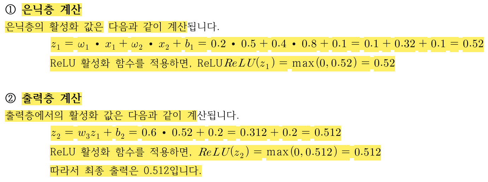

**5.3.7. 신경망 (Neural Networks)**

# 5.3.7. 신경망 (Neural Networks)

## 1. 신경망(Neural Networks) — 개념

- **정의**: 뇌의 신경 세포 구조에서 영감을 받은 모델. 노드(뉴런) 계층이 입력을 받아 가중치를 곱하고 활성화 함수로 출력을 생성한다.
- **구성 요소**
<br>(1) **입력층 (Input Layer)**: 네트워크에 들어오는 데이터를 받는 첫 번째 층입니다.
<br>(2) **은닉층 (Hidden Layer)**: 입력 데이터를 처리하는 내부 층으로, 여러 개의 은닉층을 사용할 수 있습니다.
<br>(3) **출력층 (Output Layer)**: 모델의 최종 예측을 출력하는 층입니다.
<br>(4) **가중치 (Weights)**: 각 연결에 할당된 값으로, 학습을 통해 최적화됩니다.
<br>(5) **편향 (Bias)**: 출력에 추가되는 값으로, 모델의 예측 성능을 향상시키기 위해 학습됩니다.
<br>(6) **활성화 함수 (Activation Function)**: 뉴런의 출력값을 결정하는 함수로 비선형성(Non-linearity)을 추가하여 더 복
잡한 패턴을 학습할 수 있게 합니다.
- **학습 과정**: 역전파(Backpropagation)로 예측값과 실제값의 오차를 계산해 전파하고, 경사 하강법으로 가중치와 편향을 업데이트한다.
                 이 과정을 **경사 하강법(Gradient Descent)**을 사용해 최소화하며 최적의 가중치와 편향을 찾습니다.

## 2. 계산 예제로 보는 신경망 동작

2입력·1은닉·1출력 구조의 간단한 신경망이 입력을 받아 최종 출력을 만들어내는 과정을 단계별로 정리하면 다음과 같다.

| 단계 | 계산 | 비고 |
|---|---|---|
| 구조 | 입력 노드 2개 → 은닉 노드 1개 → 출력 노드 1개 | 활성화 함수: ReLU |
| ① 은닉층 | 은닉값 = ReLU(입력·가중치의 합 + 은닉층 편향) | 음수면 0, 양수면 그대로 출력 |
| ② 출력층 | 출력값 = ReLU(은닉값·출력가중치 + 출력층 편향) | ①의 결과를 다시 ReLU에 통과 |
| ③ 결과 | 최종 출력 = 0.512 | 책에 제시된 계산 결과값 |

> 

## 3. 실전 코드 — MNIST 이미지 분류
이미지 분류에서 신경망을 사용하는 대표적인 예는 MNIST 데이터셋을 이용한 손글씨 숫자 인식입니다. <br>
여기서는 Python을 사용하여 MNIST 데이터셋을 분류하는 간단한 신경망 예시를 제공

**예제 코드**: `ch05/classification22.py`

```python
import tensorflow as tf
from tensorflow.keras.models import Sequential
from tensorflow.keras.layers import Dense, Flatten
from tensorflow.keras.datasets import mnist
from tensorflow.keras.utils import to_categorical
(x_train, y_train), (x_test, y_test) = mnist.load_data()
x_train = x_train / 255.0
x_test = x_test / 255.0
y_train = to_categorical(y_train, 10)
y_test = to_categorical(y_test, 10)
model = Sequential([
    Flatten(input_shape=(28, 28)),   # 28x28 이미지를 1차원으로 펼침
    Dense(128, activation='relu'),   # 은닉층 128개 뉴런
    Dense(10, activation='softmax')  # 출력층 10개 뉴런(0~9)
])
model.compile(optimizer='adam', loss='categorical_crossentropy', metrics=['accuracy'])
model.fit(x_train, y_train, epochs=5)
test_loss, test_acc = model.evaluate(x_test, y_test)
print(f"테스트 정확도: {test_acc}")
```

<details>
<summary><span class="label-badge">코드분석</span></summary>

```python
"""
신경망 (Neural Networks) :

1. 다층 신경망(MLP)을 이용한 MNIST 손글씨 숫자 분류
이미지를 1차원으로 펼친 뒤 완전연결층(Dense)만으로 구성된 가장 기본적인 신경망입니다.
출력층의 softmax와 one-hot 인코딩된 라벨을 사용해 10개 숫자 중 하나로 분류합니다.
"""

import tensorflow as tf  # 딥러닝 프레임워크 (신경망 구축·학습·추론을 위한 라이브러리)
from tensorflow.keras.models import Sequential  
# Sequential: 레이어를 위에서 아래로 순서대로 하나씩 쌓아 모델을 구성하는 가장 기본적인 방식
# → 입력이 레이어1 → 레이어2 → ... 순서로 한 방향으로만 흐르는 단순한 구조에 적합
from tensorflow.keras.layers import Dense, Flatten  
# Dense: 완전연결층(모든 입력 뉴런이 모든 출력 뉴런과 연결됨) — 신경망의 가장 기본 레이어
# Flatten: 다차원 배열(예: 28x28 이미지)을 1차원 벡터(784개)로 펼쳐주는 레이어
from tensorflow.keras.datasets import mnist  # 예제용 손글씨 숫자 데이터셋 (28x28 흑백 이미지, 0~9 숫자)
from tensorflow.keras.utils import to_categorical  
# to_categorical: 정수 라벨(예: 3)을 one-hot 벡터(예: [0,0,0,1,0,0,0,0,0,0])로 변환
# → softmax 출력층 + categorical_crossentropy 손실 함수와 짝을 이루는 라벨 형식

# ── MNIST 데이터셋 로드 ──────────────────────────────────────
(x_train, y_train), (x_test, y_test) = mnist.load_data()  
# 케라스에 내장된 함수로 자동 다운로드 (최초 실행 시 인터넷 필요)
# x_train: (60000, 28, 28) 형태의 훈련 이미지, y_train: 그에 대응하는 정답 숫자(0~9)
# x_test: (10000, 28, 28) 형태의 테스트 이미지, y_test: 정답 숫자

# ── 데이터 전처리: [0, 255] -> [0, 1]로 스케일 조정 ─────────
x_train = x_train / 255.0  # 원래 픽셀값은 0(검정)~255(흰색) 범위 → 255로 나눠 0~1 사이로 정규화
x_test = x_test / 255.0
# 정규화하는 이유: 신경망은 입력값의 스케일이 작고 일정할 때 학습이 더 안정적이고 빠르게 수렴함

# ── 레이블을 one-hot 인코딩 ──────────────────────────────────
y_train = to_categorical(y_train, 10)  # 예: 3 -> [0,0,0,1,0,0,0,0,0,0] (10개 숫자 클래스이므로 길이 10)
y_test = to_categorical(y_test, 10)
# → 출력층이 10개 뉴런(숫자 0~9 각각의 확률)을 내놓으므로, 정답도 같은 형태(10차원)로 맞춰줘야 함

# ── 모델 정의 ────────────────────────────────────────────────
model = Sequential([
    Flatten(input_shape=(28, 28)),      
    # 28x28 이미지를 784개짜리 1차원 배열로 펼침
    # input_shape=(28,28): 모델이 받을 입력 하나의 형태를 지정 (배치 크기는 자동으로 처리됨)
    Dense(128, activation='relu'),      
    # 은닉층: 128개의 뉴런, 각 뉴런이 784개 입력 전부와 연결됨(완전연결)
    # activation='relu': 음수는 0으로, 양수는 그대로 통과시키는 활성화 함수
    #   → 비선형성을 부여해 신경망이 단순 직선 관계 이상을 학습할 수 있게 함
    Dense(10, activation='softmax')     
    # 출력층: 10개의 뉴런 (0~9 숫자 각각에 대응)
    # activation='softmax': 10개 출력값을 모두 더하면 1이 되는 확률 분포로 변환
    #   → 가장 확률이 높은 인덱스가 모델이 예측한 숫자가 됨
])

# ── 모델 컴파일 ───────────────────────────────────────────────
model.compile(
    optimizer='adam',                     # 가중치를 업데이트하는 최적화 알고리즘 (널리 쓰이는 기본값)
    loss='categorical_crossentropy',      # one-hot 인코딩된 다중 클래스 라벨에 맞는 손실 함수
                                           # → 모델이 예측한 확률 분포와 실제 정답(one-hot) 간의 차이를 계산
    metrics=['accuracy']                  # 학습 중 모니터링할 지표로 정확도를 함께 기록
)
# compile()은 실제 학습을 시작하는 게 아니라, "어떤 방식으로 학습할지" 설정만 하는 단계

# ── 모델 훈련 ─────────────────────────────────────────────────
model.fit(x_train, y_train, epochs=5)  
# epochs=5: 전체 훈련 데이터(60000장)를 5번 반복해서 학습
# → 학습이 진행되며 각 epoch마다 loss(손실)와 accuracy(정확도)가 출력됨

# ── 모델 평가 ─────────────────────────────────────────────────
test_loss, test_acc = model.evaluate(x_test, y_test)  
# evaluate(): 학습에 전혀 사용되지 않은 테스트 데이터로 최종 성능을 측정
# 반환값: (손실값, 정확도) 튜플
print(f"테스트 정확도: {test_acc}")

# ─────────────────────────────────────────────────────────────
# [교안용 설명 포인트]
# 1) sklearn 예제들과 달리 여기서는 fit() 한 번에 "학습 데이터 저장"이 아니라
#    실제 경사하강법 기반의 반복 학습이 일어난다는 점을 강조하면 좋음
#    (KNN은 fit()이 저장만 하는 lazy learner였다는 점과 대비해서 설명하면 효과적)
# 2) Flatten으로 28x28 이미지의 '공간적 배치 정보'가 사라진다는 점을 짚어주면,
#    나중에 CNN(합성곱 신경망)을 배울 때 "왜 이미지에는 CNN이 더 적합한가"로 자연스럽게 연결됨
# 3) epochs 값을 5 → 1, 5 → 20으로 바꿔가며 정확도와 학습 시간이 어떻게 달라지는지
#    직접 비교해보는 실습, 그리고 epoch가 너무 많을 때 과적합이 나타나는지 관찰하는 심화 실습
# 4) activation='relu' 대신 'sigmoid'로 바꿔보고 학습 속도·정확도 차이를 비교하는 것도
#    활성화 함수 선택의 중요성을 체감시키는 좋은 포인트
# ─────────────────────────────────────────────────────────────
```

</details>

- **MNIST 데이터셋 로드**: mnist.load_data()로 손글씨 이미지와 레이블을 로드합니다.
- **데이터 전처리**: 이미지를 [0, 255] 범위에서 [0, 1] 범위로 정규화합니다.
- **모델 정의**: Flatten: 28x28 크기의 2D 이미지를 1D 벡터로 변환합니다.
- **Dense**: 은닉층과 출력층을 정의합니다. 은닉층에는 128개의 뉴런을 사용하고, 출력층은 10개의 뉴런으로 설정하여 0
부터 9까지의 숫자를 분류합니다.
- **모델 컴파일**: adam 옵티마이저와 categorical_crossentropy 손실 함수를 사용하여 다중 클래스 분류를 수행합니다.
- **모델 훈련**: 훈련 데이터를 사용하여 모델을 학습시킵니다.
- **모델 평가**: 테스트 데이터로 모델을 평가하고 정확도를 출력합니다. <br>
> *신경망(Neural Networks)은 여러 층을 거쳐 입력 데이터를 변환하며, 복잡한 패턴을 학습할 수 있습니다.<br>
이미지 분류 문제에서는 신경망을 사용하여, 예를 들어 손글씨 숫자 인식(MNIST 데이터셋)과 같은 문제를 해결할 수 
있습니다.<br>
신경망의 핵심은 가중치와 편향을 학습하여, 새로운 데이터를 정확하게 예측할 수 있도록 모델을 조정하는 것입니다.<br>
위 코드는 TensorFlow와 Keras를 사용하여 간단한 신경망을 구축하고, MNIST 데이터를 분류하는 예시*

**실행 결과**

```
Epoch 1/5  accuracy 0.111 loss 2.351
Epoch 3/5  accuracy 0.122 loss 2.299
Epoch 5/5  accuracy 0.121 loss 2.297
평가(테스트): accuracy 0.090 loss 2.305
테스트 정확도: 0.090
```

---

## 4. 신경망 실습 — 3가지 응용

이번 절에서는 CNN(합성곱 신경망)을 활용해 이미지 분류, 음성 인식, 자율 주행 객체 인식이라는 서로 다른 3가지 응용 문제를 실습한다. <br>세 예제 모두 합성곱층과 풀링층을 쌓아 특징을 추출하고, Dense층으로 최종 분류를 수행하는 동일한 기본 구조를 공유한다.

### ① 이미지 분류 — CIFAR-10
CIFAR-10 데이터셋은 10개의 클래스로 이루어진 작은 이미지 데이터셋입니다. <br> 이 데이터셋을 사용하여 이미지 분류 
문제를 해결하는 예시입니다.

**예제 코드**: `ch05/classification23.py`

```python
import tensorflow as tf
from tensorflow.keras.datasets import cifar10
from tensorflow.keras.models import Sequential
from tensorflow.keras.layers import Dense, Flatten, Conv2D, MaxPooling2D
from tensorflow.keras.utils import to_categorical
(x_train, y_train), (x_test, y_test) = cifar10.load_data()
x_train, x_test = x_train / 255.0, x_test / 255.0
y_train, y_test = to_categorical(y_train, 10), to_categorical(y_test, 10)
model = Sequential([
    Conv2D(32, (3,3), activation='relu', input_shape=(32,32,3)),  # 합성곱층
    MaxPooling2D(pool_size=(2,2)),                                 # 풀링층
    Conv2D(64, (3,3), activation='relu'),
    MaxPooling2D(pool_size=(2,2)),
    Flatten(),
    Dense(128, activation='relu'),
    Dense(10, activation='softmax')   # 10개 클래스
])
model.compile(optimizer='adam', loss='categorical_crossentropy', metrics=['accuracy'])
model.fit(x_train, y_train, epochs=10)
test_loss, test_acc = model.evaluate(x_test, y_test)
print(f"테스트 정확도: {test_acc}")
```

<details>
<summary><span class="label-badge">코드분석</span></summary>

```python
"""
2. CNN(합성곱 신경망)을 이용한 CIFAR-10 이미지 분류
classification22.py의 MLP는 이미지를 펼쳐서 픽셀 위치 정보를 무시하지만,
CNN은 Conv2D/MaxPooling2D로 이미지의 지역적 패턴(선, 모서리, 형태)을 유지한 채 학습합니다.
CIFAR-10은 32x32 컬러(RGB 3채널) 이미지 10종류(비행기, 자동차, 새 등)로 구성됩니다.
"""

import tensorflow as tf  # 딥러닝 프레임워크
from tensorflow.keras.datasets import cifar10  # 예제용 컬러 이미지 데이터셋 (32x32, RGB 3채널, 10개 클래스)
from tensorflow.keras.models import Sequential  # 레이어를 순서대로 쌓는 모델 구성 방식
from tensorflow.keras.layers import Dense, Flatten, Conv2D, MaxPooling2D  
# Conv2D: 작은 필터(커널)를 이미지 위에 슬라이딩시키며 지역적 패턴(선, 모서리 등)을 감지하는 합성곱층
# MaxPooling2D: 특징맵을 작은 영역으로 나눠 그중 최댓값만 남겨 크기를 줄이는 풀링층
#   → 연산량을 줄이고, 위치가 약간 달라져도 같은 특징을 인식하게 해주는 효과(위치 불변성)
from tensorflow.keras.utils import to_categorical  # 정수 라벨을 one-hot 벡터로 변환하는 함수

# ── CIFAR-10 데이터셋 로드 ────────────────────────────────────
(x_train, y_train), (x_test, y_test) = cifar10.load_data()  
# x_train: (50000, 32, 32, 3) 형태 — 5만 장의 32x32 컬러(RGB 3채널) 이미지
# y_train: 각 이미지의 클래스 번호 (0~9, 비행기/자동차/새/고양이 등 10종류)
# x_test: (10000, 32, 32, 3) 형태의 테스트 이미지

# ── 데이터 전처리: [0, 255] -> [0, 1]로 스케일 조정 ─────────
x_train = x_train / 255.0  # RGB 각 채널의 픽셀값(0~255)을 0~1 범위로 정규화
x_test = x_test / 255.0

# ── 레이블을 one-hot 인코딩 ──────────────────────────────────
y_train = to_categorical(y_train, 10)  # 예: 3 -> [0,0,0,1,0,0,0,0,0,0]
y_test = to_categorical(y_test, 10)

# ── 모델 정의 ────────────────────────────────────────────────
model = Sequential([
    Conv2D(32, (3, 3), activation='relu', input_shape=(32, 32, 3)),  
    # 32개의 서로 다른 3x3 필터를 이미지 위에 슬라이딩하며 32장의 '특징맵' 생성
    # input_shape=(32,32,3): 첫 레이어에서만 입력 형태(가로,세로,채널) 지정
    # → 1번 예제(MLP)의 Flatten과 달리, 여기서는 2D 구조(가로x세로)를 그대로 유지한 채 처리

    MaxPooling2D(pool_size=(2, 2)),  
    # 2x2 영역 안에서 가장 큰 값만 남김 → 특징맵의 가로/세로 크기가 절반으로 축소됨
    # (연산량 감소 + 약간의 위치 변화에 덜 민감해지는 효과)

    Conv2D(64, (3, 3), activation='relu'),  
    # 필터 수를 32→64로 늘려, 앞 단계보다 더 복잡하고 추상적인 패턴(형태, 질감 등)을 학습
    # (합성곱층을 쌓을수록 더 깊은/추상적인 특징을 인식하게 되는 CNN의 전형적 구조)

    MaxPooling2D(pool_size=(2, 2)),  # 다시 한 번 크기 축소

    Flatten(),  
    # 여기까지 쌓인 2D 특징맵들을 완전연결층에 넣기 위해 1차원으로 펼침
    # → 1번 예제는 '원본 이미지'를 바로 펼쳤지만, 여기서는 'CNN이 추출한 특징맵'을 펼치는 것이 핵심 차이

    Dense(128, activation='relu'),  # 완전연결층 — 펼쳐진 특징들을 조합해 최종 판단 준비
    Dense(10, activation='softmax')  # 출력층 — 10개 클래스에 대한 확률 분포 출력
])

# ── 모델 컴파일 ───────────────────────────────────────────────
model.compile(optimizer='adam', loss='categorical_crossentropy', metrics=['accuracy'])  
# one-hot 라벨 + 다중 클래스 분류에 맞는 손실 함수 (1번 예제와 동일한 설정)

# ── 모델 훈련 ─────────────────────────────────────────────────
model.fit(x_train, y_train, epochs=10)  
# epochs=10: 1번 예제(5 epoch)보다 더 많이 반복
# → CIFAR-10이 MNIST보다 복잡한(컬러, 다양한 사물) 데이터라 학습에 더 많은 반복이 필요

# ── 모델 평가 ─────────────────────────────────────────────────
test_loss, test_acc = model.evaluate(x_test, y_test)  # 테스트 데이터에 대한 손실과 정확도 계산
print(f"테스트 정확도: {test_acc}")

# ─────────────────────────────────────────────────────────────
# [교안용 설명 포인트]
# 1) 1번(MLP, MNIST)과 2번(CNN, CIFAR-10)을 나란히 비교하며
#    "Flatten을 언제 하느냐"의 차이를 강조 — MLP는 원본 이미지를 바로 펼치고,
#    CNN은 합성곱+풀링으로 특징을 먼저 추출한 뒤에 펼친다는 점이 핵심
# 2) CIFAR-10(컬러, 복잡한 사물)이 MNIST(흑백, 단순한 숫자)보다 어려운 문제라
#    같은 구조의 모델이라도 정확도가 상대적으로 낮게 나올 수 있음을 언급하면 좋음
# 3) Conv2D의 필터 개수(32→64)와 필터 크기(3x3)를 바꿔가며 정확도/학습시간 변화를
#    비교하는 실습, MaxPooling을 제거했을 때 연산량이 어떻게 늘어나는지 비교도 좋은 확장 포인트
# 4) 마지막 Dense층 이전에 Dropout 레이어를 추가해보고 과적합 방지 효과를 관찰하는
#    심화 실습으로 이어가기 좋음
# ─────────────────────────────────────────────────────────────
```

</details>

- **CIFAR-10 데이터셋 로드**: cifar10.load_data()로 10개의 클래스로 이루어진 이미지 데이터셋을 로드합니다.
- **데이터 전처리**: 이미지를 [0, 255] 범위에서 [0, 1] 범위로 정규화하고, 레이블을 one-hot 인코딩합니다.
- **모델 정의**: Convolutional Layer: 이미지 데이터에서 특징을 추출하기 위해 필터를 적용합니다.
- **MaxPooling Layer**: 이미지의 크기를 줄여 계산량을 감소시킵니다.
- **Dense Layer**: 추출된 특징을 바탕으로 예측을 수행합니다.
- **모델 훈련**: 훈련 데이터를 사용해 모델을 학습시킵니다.
- **모델 평가**: 테스트 데이터를 사용해 모델을 평가하고 정확도를 출력합니다.

> *Conv2D+MaxPooling2D 2단 스택 → Flatten → Dense — 합성곱으로 특징 추출 후 분류*

**실행 결과**

```
Epoch 1/10  accuracy 0.093 loss 2.313
Epoch 5/10  accuracy 0.121 loss 2.298
Epoch 10/10  accuracy 0.460 loss 1.781  (훈련 데이터 암기 시작)
평가(테스트): accuracy 0.084 loss 2.574
테스트 정확도: 0.084
```

### ② 음성 인식 — 스펙트로그램 분류
음성 데이터를 텍스트로 변환하는 문제는 스펙트로그램을 입력으로 사용하여 신경망 모델을 훈련시킬 수 있습니다. <br>
예시에서는 Librosa 라이브러리를 사용하여 오디오 파일에서 스펙트로그램을 추출하고 이를 이용해 신경망을 훈련

**예제 코드**: `ch05/classification24.py`

```python
import librosa, librosa.display
import numpy as np, tensorflow as tf
from tensorflow.keras.models import Sequential
from tensorflow.keras.layers import Dense, Flatten, Conv2D, MaxPooling2D
import matplotlib.pyplot as plt
audio_file = librosa.example('trumpet')   # 예시 음성 파일
y, sr = librosa.load(audio_file)
D = librosa.amplitude_to_db(np.abs(librosa.stft(y)), ref=np.max)
librosa.display.specshow(D, sr=sr, x_axis='time', y_axis='log')
plt.colorbar(format='%+2.0f dB'); plt.title('Spectrogram'); plt.show()
D = np.expand_dims(D, axis=-1)   # (time, freq, 1)
D = np.expand_dims(D, axis=0)    # 배치 차원 추가
model = Sequential([
    Conv2D(32, (3,3), activation='relu', input_shape=D.shape[1:]),
    MaxPooling2D(pool_size=(2,2)),
    Flatten(),
    Dense(64, activation='relu'),
    Dense(2, activation='softmax')   # 음악/음성 2클래스
])
model.compile(optimizer='adam', loss='categorical_crossentropy', metrics=['accuracy'])
y_fake = np.array([[1, 0]])   # 예시 라벨
model.fit(D, y_fake, epochs=10)
```

<details>
<summary><span class="label-badge">코드분석</span></summary>

```python
"""
3. 오디오 스펙트로그램 + CNN을 이용한 음성/음악 분류 (개념 예제)
소리 신호를 스펙트로그램(시간-주파수 에너지 분포를 이미지처럼 표현한 것)으로 변환하면,
이미지 분류에 쓰던 CNN을 오디오 분류에도 그대로 적용할 수 있습니다.
이 예제는 샘플 1개로 학습 과정만 보여주는 개념 예제이며, 실제 분류 성능은 의미가 없습니다.
"""

import librosa  # 오디오 신호 처리 라이브러리 (로드, 변환, 특징 추출 등)
import librosa.display  # 오디오 시각화(스펙트로그램 등) 서브모듈
import numpy as np  # 수치 연산 라이브러리
import tensorflow as tf  # 딥러닝 프레임워크
from tensorflow.keras.models import Sequential  # 레이어를 순서대로 쌓는 모델 구성 방식
from tensorflow.keras.layers import Dense, Flatten, Conv2D, MaxPooling2D  # 완전연결층, 펼치기, 합성곱층, 풀링층
import matplotlib.pyplot as plt  # 그래프 시각화 라이브러리

# ── 음성 데이터 로드 ──────────────────────────────────────────
audio_file = librosa.example('trumpet')  
# librosa.example(): librosa가 제공하는 샘플 오디오 파일 경로를 반환 (최초 실행 시 인터넷으로 다운로드)

y, sr = librosa.load(audio_file)  
# y: 오디오 파형(시간에 따른 진폭 값들의 1차원 배열)
# sr: 샘플링 레이트(sample rate) — 1초에 몇 번 소리를 측정했는지(기본값 22050Hz)
# ⚠️ 이 y는 위쪽 신경망 예제들의 y(정답 라벨)와 이름만 같을 뿐 전혀 다른 의미이므로 헷갈리지 않도록 주의

# ── 스펙트로그램 계산 ─────────────────────────────────────────
D = librosa.amplitude_to_db(np.abs(librosa.stft(y)), ref=np.max)  
# librosa.stft(y): 단시간 푸리에 변환(Short-Time Fourier Transform)
#   → 소리를 짧은 구간(프레임)으로 나눠 각 구간에 어떤 주파수 성분이 얼마나 섞여 있는지 계산
# np.abs(...): STFT 결과(복소수)에서 크기(진폭) 성분만 추출
# librosa.amplitude_to_db(..., ref=np.max): 진폭을 사람이 소리 크기를 인식하는 방식에 가까운
#   데시벨(dB) 스케일로 변환, ref=np.max로 최댓값을 0dB 기준으로 정규화
# 결과 D: (주파수 구간 수, 시간 프레임 수) 형태의 2차원 배열 → "소리를 이미지처럼 표현한 것"

# ── 스펙트로그램 시각화 ───────────────────────────────────────
plt.figure(figsize=(10, 6))
librosa.display.specshow(D, sr=sr, x_axis='time', y_axis='log')  
# x_axis='time': 가로축을 실제 시간(초)으로 표시
# y_axis='log': 세로축(주파수)을 로그 스케일로 표시 (사람 청각이 로그 스케일에 가깝게 반응하기 때문)
plt.colorbar(format='%+2.0f dB')  # 색상이 나타내는 에너지 크기(dB)를 범례로 표시
plt.title('Spectrogram')
plt.show()

# ── 데이터 형태 변환 (모델 입력에 맞게 크기 조정) ─────────────
D = np.expand_dims(D, axis=-1)  
# (주파수, 시간) 2차원 → (주파수, 시간, 1) 3차원으로 변환
# → CNN(Conv2D)은 이미지 데이터를 (높이, 너비, 채널) 형태로 기대하므로
#   흑백 이미지처럼 '채널 1개'라는 차원을 인위적으로 추가해줌 (2번 CIFAR-10 예제의 채널 3과 대응되는 자리)

D = np.expand_dims(D, axis=0)   
# 맨 앞에 배치(batch) 차원 추가 → (1, 주파수, 시간, 1)
# → 케라스 모델은 항상 "여러 샘플을 한 번에" 입력받는 형태를 기대하므로,
#   샘플이 1개뿐이어도 배치 차원(맨 앞의 1)이 반드시 있어야 함

# ── 모델 정의 ────────────────────────────────────────────────
model = Sequential([
    Conv2D(32, (3, 3), activation='relu', input_shape=D.shape[1:]),  
    # input_shape=D.shape[1:]: 배치 차원(맨 앞 1)을 제외한 (주파수, 시간, 1) 형태를 입력 크기로 지정
    # → 이미지든 스펙트로그램이든 CNN 입장에서는 그냥 '숫자가 채워진 2차원 격자 + 채널'일 뿐이라
    #   2번 예제(CIFAR-10)와 동일한 Conv2D 구조를 그대로 재사용할 수 있음

    MaxPooling2D(pool_size=(2, 2)),  # 크기를 줄여 연산량을 줄이는 풀링층
    Flatten(),  # 2차원 특징맵을 1차원으로 펼침
    Dense(64, activation='relu'),  # 완전연결층
    Dense(2, activation='softmax')  # 예시로 두 가지 클래스로 분류 (음악/음성)
])

# ── 모델 컴파일 ───────────────────────────────────────────────
model.compile(optimizer='adam', loss='categorical_crossentropy', metrics=['accuracy'])  

# ── 가짜 라벨 생성 (예시용) ───────────────────────────────────
y_fake = np.array([[1, 0]])  
# one-hot 형태의 가짜 정답 라벨 1개 (예: [1,0]=음악, [0,1]=음성이라고 가정)
# ⚠️ 샘플이 이 오디오 1개뿐이므로, 모델이 "이 특정 스펙트로그램 하나를 외우는" 것 이상의
#    의미 있는 학습은 일어나지 않음 — 코드 구조(전처리→모델 정의→학습→평가)를 보여주기 위한 것

# ── 모델 훈련 ─────────────────────────────────────────────────
model.fit(D, y_fake, epochs=10)  # 샘플 1개로 10 epoch 학습 (개념 확인용, 실전 학습 아님)

# ── 예시로 모델 평가 ──────────────────────────────────────────
test_loss, test_acc = model.evaluate(D, y_fake)  
# 학습에 사용한 것과 동일한 샘플로 평가 → 사실상 "외운 답 그대로 맞히는지" 확인하는 것과 같음
# (훈련/테스트를 분리하지 않았으므로 정확도가 100%로 나오는 게 당연하며, 실제 성능 지표로 쓸 수 없음)
print(f"테스트 정확도: {test_acc}")

# ─────────────────────────────────────────────────────────────
# [교안용 설명 포인트]
# 1) 이 예제의 핵심 메시지는 "이미지 분류에 쓰던 CNN 구조를 소리에도 그대로 쓸 수 있다"는 것
#    — 스펙트로그램으로 변환하는 순간 오디오 문제가 이미지 문제로 바뀐다는 개념을 강조
# 2) 2번 CIFAR-10 예제와 나란히 놓고 "채널 수만 3(RGB) → 1(흑백/스펙트로그램)로 바뀌었을 뿐,
#    Conv2D/MaxPooling2D 구조 자체는 동일하다"는 점을 짚어주면 CNN의 범용성을 잘 보여줄 수 있음
# 3) 실전에서는 샘플 1개가 아니라 여러 오디오 파일(예: 음악 폴더, 음성 폴더)을 모아
#    각각 스펙트로그램으로 변환한 뒤 배치로 학습해야 한다는 점을 강조 —
#    "왜 이 코드 그대로는 실전에 못 쓰는가"를 학생들이 직접 이야기해보게 하면 좋은 복습 활동
# 4) STFT의 윈도우 크기(n_fft), hop_length 등의 파라미터를 바꿔가며 스펙트로그램 해상도가
#    어떻게 달라지는지 시각화로 비교해보는 심화 실습으로 확장 가능
# ─────────────────────────────────────────────────────────────
```

</details>

- **Librosa를 사용하여 음성 파일 로드**: librosa.load()로 음성 데이터를 로드합니다.
- **스펙트로그램 계산**: librosa.stft()로 음성 데이터를 시간-주파수 도메인으로 변환하고, amplitude_to_db()로 이를 dB
로 변환하여 스펙트로그램을 생성합니다.
- **스펙트로그램 시각화**: librosa.display.specshow()로 스펙트로그램을 시각화합니다.
- **모델 정의**: CNN을 사용하여 스펙트로그램을 입력으로 처리합니다.
- **모델 훈련**: 더미 라벨을 사용하여 모델을 훈련시킵니다.
> *STFT → dB 스펙트로그램 → CNN — 오디오를 이미지처럼 취급해 분류*

**실행 결과**

![스펙트로그램 분류 실행 결과](data:image/png;base64,iVBORw0KGgoAAAANSUhEUgAAA4cAAAJYCAYAAADR8pPYAAAAOnRFWHRTb2Z0d2FyZQBNYXRwbG90bGliIHZlcnNpb24zLjEwLjksIGh0dHBzOi8vbWF0cGxvdGxpYi5vcmcvJkbTWQAAAAlwSFlzAAAQ6wAAEOsBUJTofAAAhidJREFUeJzt3Xtc1FX+x/H3lzsiCAgq3i+peMlLXtIuKrpKoKWkq2Zbuqa7bluumVm5W6GV2eZtu1jtZlZbpqnpr0zU8lZuGmY3UzGzLC+kqQgposB8f38YI+N8IZAZZgZfTx/fx8M5c+acMzOMzofPuRimaZoCAAAAAFzW/Dw9AAAAAACA5xEcAgAAAAAIDgEAAAAABIcAAAAAABEcAgAAAABEcAgAAAAAEMEhAAAAAEAEhwAAAAAAERwCAAAAAERwCAAAAAAQwSEAAAAAQASHAOBTjh49qgceeEBXXnmlIiIiFB4erqZNmyolJUXz58/39PAcrFixQqmpqZ4eBgAAKCPDNE3T04MAAPy2H3/8UV27dtWxY8c0ZMgQXXPNNQoKCtJ3332nzZs365dfftGOHTs8PUy7UaNG6dVXXxX/zQAA4BsCPD0AAEDZPPXUUzpy5Ijmzp2rv/3tb073//TTTx4YlesUFhbq7NmzqlatWqX2a5qmTp8+rerVq1dqvwAAeBumlQKAj9i7d68kqU+fPpb316lTx/73Xr16qXHjxvrhhx80ePBgRUVFKSwsTH379tVnn31m+fhly5apZ8+eioiIUGhoqDp27KiXXnrJsu5XX32lW265RXXr1lVQUJDq1aungQMHavv27ZKkxo0b69VXX5UkGYZhv1555RVJUmpqqgzD0K5duzR58mQ1atRIwcHBeuuttyRJeXl5mjp1quLj4xUSEqLo6GjdeOON+vTTT53GYpqm5syZo+bNmys4OFjNmjXTE088oXXr1jn0KUmvvPKKDMPQBx98oCeeeEItWrRQcHCwZs6cKUlKT0/X6NGj1bJlS4WFhSksLExdunTRggULnPoteg67d+/WpEmTVK9ePVWrVk3XXHON0tPTJUn/+9//1KtXL1WvXl2xsbGaOHGiCgoKLF9TAAA8jcwhAPiIZs2aSZIWLFigJ598UgEBpf8Tfvr0afXs2VMdO3bUY489pgMHDmjevHnq0aOH/ve//6l9+/b2uo888oimTZumhIQEPfLIIwoNDdWaNWs0duxYffvtt5oxY4a9blpamlJSUhQUFKQ77rhD8fHxOn78uDZt2qSPP/5YnTp10ty5czV79mx99NFH+u9//2t/7DXXXOMwxltvvVUBAQH661//qurVq6tly5YqLCxUcnKyNmzYoOTkZN1111366aef9Pzzz+u6665TWlqaEhIS7G1MnjxZM2fOVNeuXfWXv/xFZ8+e1YIFC7R8+fISX5v77rtPubm5GjlypGJjY9WgQQNJ0vLly/X1119ryJAhatSokbKzs/XWW29p9OjR+vnnnzV58mSntkaOHKmQkBBNnjxZp0+f1syZM9W3b1/997//1ahRozRmzBgNHz5caWlpmjNnjmJjY/Xggw+W+t4BAOARJgDAJ+zbt8+sUaOGKcmsVauWOXjwYPPJJ580N2/ebBYWFjrU7dmzpynJ/Otf/+pQ/umnn5p+fn5mz5497WWfffaZaRiGOX78eKc+77rrLtPPz8/ct2+faZqmefr0aTM2NtasUaOGvay44uMYOXKkWdJ/M4888ogpybzuuuvMc+fOOdw3f/58U5I5duxYh/I9e/aYwcHBZvPmze397NmzxzQMw7z22msd2jl58qTZoEEDU5K5YMECe/mCBQtMSWazZs3MX375xWlcp06dsnxO119/vVmjRg2HPoqeQ1JSksPzXr58uSnJ9Pf3N7du3erQVocOHcy4uDjL1wQAAE9jWikA+IimTZvqyy+/1Pjx4xUWFqZly5bp/vvv13XXXacrrrhCa9eudXrMlClTHG536tRJiYmJ2rRpk44dOyZJeuONN2Sapu644w4dO3bM4brppptks9n0wQcfSJLWrl2rn3/+WRMmTFDTpk2d+vPzK99/K/fee68CAwMdypYtWyZJmjp1qkN5ixYtNGLECO3du9e+8c6KFStkmqbuueceh3Zq1Kihv/zlLyX2e9ddd1muMQwLC7P//cyZMzp+/LhOnDihG264QdnZ2dqzZ4/TY+655x6H592zZ09J0tVXX62rr77aoW6PHj2UmZmpU6dOlTg2AAA8heAQAHxIo0aN9K9//Uvfffedjhw5ohUrVmjEiBHav3+/UlJS9O2339rrRkZGqm7duk5ttG7dWpK0b98+SdLu3bslSe3bt1dsbKzD1a9fP0nSkSNHJEnffPONJOmqq65yyfNp0aKFU9l3332nmjVrKi4uzum+K6+80mHs3333nSQpPj7eqW6rVq3K1a8kHTt2THfeeafq1q2ratWqKSYmRrGxsfr73/8uSTpx4oTTYy4OkqOioizLi993/PjxEscGAICnsOYQAHxUrVq1NHDgQA0cOFANGzbUjBkztGjRIv3jH/8oVzs2m02StHLlSgUHB1vWsQp0XKGydyYtrV/TNJWYmKgdO3bo7rvvVpcuXRQVFSV/f3+tWrVKc+bMsb9Wxfn7+1v2UVJ5UV8AAHgbgkMAqAKKNno5dOiQvezkyZM6fPiwU/Zw165dki5scNOiRQutXr1acXFxv5kRLMq4ff7557rppptKrWsYRvmexK+aNWumjIwMHTlyRLVr13a47+uvv3YYe1HQmpGRoTZt2jjULcqIltWOHTv02Wef6aGHHtK0adMc7nv//ffL1RYAAL6IaaUA4CM2btyo3Nxcy/uKduYsmjJaZPr06Q63t2/frjVr1qhHjx6KiYmRJN12222SpAcffFD5+flObWdnZ+vs2bOSpH79+ik2NlZz587V/v37neoWz6wVremzmopZmptvvlmS9OijjzqUf/vtt1q4cKGaN2+udu3aSZIGDhwowzA0Z84ch7FnZ2fr+eefL1e/RZm+i7N6hw8fLvFIDwAAqhIyhwDgI+bOnasNGzZowIAB6tSpk6KionTs2DG999572rRpk9q2bavRo0fb68fExGjlypU6dOiQ+vbtqwMHDui5555TSEiI5s6da6/XuXNnPfbYY/rHP/6htm3b6pZbblH9+vV19OhR7dixQ//3f/+nXbt2qXHjxqpWrZoWLFigm2++We3bt7cfZZGVlaVNmzYpKSlJd999tySpW7duevbZZ3XnnXeqf//+CgwM1NVXX60mTZqU+jxvv/12vf7663ruuef0448/KjEx0X6UhWmaevHFF+1ZyZYtW2rChAmaM2eOrrvuOg0bNkznzp3TggULFBcXpwMHDpQ5gxkfH6+2bdvqn//8p06dOqU2bdro+++/14svvqhmzZqVO8gFAMDXEBwCgI948MEH1aJFC23atEnr1q3T8ePHFRoaqhYtWmjatGmaMGGCw26bYWFh2rhxo+69915NmTJF+fn56tatm5588kl17NjRoe2///3v6ty5s55++mk9++yzysnJUWxsrFq2bKnHHntMderUsdft37+/tmzZounTp+v111/XyZMnFRsbq6uvvlrXXnutvd4tt9yizz//XIsWLdKSJUtks9m0YMGC3wwOAwICtGrVKs2YMUNvvvmm1qxZo2rVqum6667Tww8/rC5dujjUnzVrlurWrasXXnhBDz74oOrVq6exY8eqVatWSklJUWhoaJleX39/f7333nu6//77tXDhQuXk5Khly5b65z//KT8/P/3xj38sUzsAAPgqw2RVPABUOb169dL+/fstp35eLp566ilNnjxZW7dudTpSAgAAOGPNIQDAp1mtw8zOztYzzzyj2NhYpywpAACwxrRSAIBPW7hwoV544QXdeOONqlu3rn788UctWLBAhw4d0ssvv6ygoCBPDxEAAJ9A5hAA4NM6dOigWrVq6YUXXtBf//pXPf3007riiiv0zjvvsE4QAOAR7777rtq3b6+QkBC1aNFCCxYsuOS2OnTooFGjRtlvp6amyjAM+xUSEqJWrVrpn//8p+V5vOVB5hAAqqCNGzd6egiVpnPnzlq1apWnhwEAgCRp8+bNSklJ0ZgxYzR37lytX79ed9xxh8LDwzVkyBCX9BEaGqr169dLks6cOaMNGzbogQcekM1m0wMPPHDJ7bIhDQAAAACUwcaNG5WQkOB0Jm5xiYmJOnXqlP73v//Zy0aMGKEvvvhCu3btKnefHTp0UIcOHfTKK69IOp85nDlzpk6dOuVQLyUlRYcOHVJ6enq5+yjCtFIAAAAAcIGzZ89qw4YN+v3vf+9QPnz4cO3evfs3dxH/+OOP1alTJ4WEhKht27ZKS0src9/h4eHKz8+/lGHbERwCAAAAgAvs27dP+fn5io+Pdyhv1aqVJCkjI6PEx/70009KTExUcHCw3nrrLd133336y1/+okOHDlnWLygoUEFBgX755Re98847WrZsWYWnrbLm0AXy8vK0Y8cOxcbGKiCAlxQAAADeoaCgQD///LOuvPJKhYSEeHo4pTp58qTTVEl3sNls8vNzzJFFREQoIiLCqa5pmiosLLTfLvp7QUGBQ72iGCArK0uSFBkZ6XB/VFSUJOnEiRMljmvu3LkyDENpaWmqUaOGJKlBgwbq06ePU93Tp08rMDDQoWzYsGEVWm8oERy6xI4dO9S1a1dPDwMAAACwlJ6eri5dunh6GCU6efKkmjVrpBMnctzeV2hoqM6cOeNQ9sgjjyg1NdWp7quvvmq58/XFgdn333+vxo0bV2hcn3zyiRISEuyBoST17t1b0dHRTnVDQ0P14YcfSjo/lXX79u16+OGHNXbsWL388suXPAaCQxeIjY399W9Bkoxi9xRY1AYAAADcwWrFmCmpoNj3Ve906tQpnTiRoy1bn1dcXE239ZOZeVzdu/1F6enpiouLs5dbZQ0l6cYbb9S2bdvst7dv365x48Y5lElS3bp1JV3IEGZnZzvcX5RRtAr0LowtU1dccYVTea1atZzK/Pz81LlzZ/vta6+9VgUFBbr33ns1ceJEtW3btsR+SkNw6AIXppKeP2ukiGka1g8AAAAAXKz499AiRZtq+srSp7jaUapf133BoX49BzAuLk7169f/zeo1a9ZUzZoXxlM07bV4YFZcs2bNFBgYqIyMDCUmJtrLi9YaXrwWsbi4uDgdPXrUqdyqzErRusadO3decnDIhjQAAAAA4ALBwcFKSEjQ0qVLHcoXL16sVq1alTr1tGvXrtqwYYND1nH9+vWlrlMs7uuvv5YkxcTElH/gv/KNXyEAAAAAqPpsNnt2z23tu9lDDz2kXr166c4779TQoUO1YcMGLVy4UIsXLy71cRMmTNBzzz2npKQkPfDAA8rKytIjjzzikLksYrPZtHXrVknSuXPntH37dj322GNq3bq1evToccljJ3MIAAAAAC5y3XXX6e2339bmzZuVmJiohQsX6qWXXnI6+/BicXFxSktL05kzZ/T73/9eTz75pJ577jnL6a9nzpxR9+7d1b17d/Xp00fPPPOM/vCHP2jDhg1Om+WUh2GaRTORcakOHjyoBg0aSAq+aM0hG9IAAACgchiGc97n/Ff9fB04cKBMa+w8pej79P69r6t+ffdtnnPw4M9q3PwPXv96eAqZQwAAAAAAaw4BAACAqqGkoyx8iGle2GLVXe2jRGQOAQAAAABkDl3J+PVPEX4vAQAAAJSDabp3R1Eyh6UicwgAAAAAIHMIAAAAwEtUgXMOfRmZQwAAAAAAmUMAAACgKii+90VxPrXKjsyhR5E5BAAAAACQOXQpw5CMYvG2T/2aBgAAAPAwMoceReYQAAAAAEDmEAAAAKgSDKu8j823ZrOZbs4cmmQOS0PmEAAAAADgPcHhO++8o6uvvlrh4eGKi4vT0KFD9d133znUWbx4sQYPHqz69evLMAzNnDnTsq3du3crOTlZYWFhioqK0m233aZjx4451FmyZIkGDhyo+vXrKywsTB06dNDLL78s06zIr1b8LroAAAAAlJVhmjJMmxsvX0qjVj6viGA2btyolJQUtW7dWsuXL9fcuXP15Zdfql+/fjpz5oy93tKlS/Xdd99pwIABJbaVk5Oj3r176+eff9bChQs1b948ffTRR+rfv79sxVLUs2fPVrVq1TRr1iy9++67SkpK0tixYzVt2jS3PlcAAAAA8EZeseZw0aJFatSokV5++WUZxvnzWWrVqqXevXvr008/1fXXXy/pfObQz+98PPviiy9atjVv3jxlZ2friy++UO3atSVJzZs3V5cuXfR///d/SklJkSS9++67iomJsT+ud+/eOn78uGbPnq2HHnrI3g8AAADgG6rA91d2K/Uor/gJys/PV3h4uD0wlKQaNWpIksM0z7IEbJ9//rnat29vDwwlqXPnzqpZs6beffdde1nxwLBIx44dlZOTo9OnT1/S8zAMP4cLAAAAAHyFV0Qwo0aN0q5du+xZv++++05TpkxRx44dde2115arrby8PAUHBzuVBwcHa/fu3aU+dvPmzapXr57Cw8PL1ScAAAAAF7CZ7r9QIq8IDq+//notX75cDzzwgCIjI9WsWTMdOXJEaWlp8vf3L1dbzZs3144dOxzWKv7444/KzMzUiRMnSnzc5s2btWjRIk2aNOk3+8jJydHBgwftV2ZmZrnGCAAAALjaxbPYmM2G8vKKn5aPP/5Yt912m8aOHav169dryZIlstls6t+/v0OQVxZjx45VTk6O/vznP+vw4cP69ttvNWrUKPn5+TlMWy3u4MGDGjZsmBISEjR+/Pjf7GP27Nlq0KCB/erateuv9/hfdAEAAAAos6I1h+68UCKvCA7Hjx+v3r17a9asWUpISNCQIUP03nvv6bPPPtN///vfcrXVsmVLzZ8/X++++67q1aun5s2bKyoqSsnJyYqLi3Oqf/LkSSUlJalmzZpatmxZmdY1Tpw4UQcOHLBf6enp5RojAAAAAHgbr9itdNeuXRo4cKBDWf369RUTE6N9+/aVu73bb79dw4cP1zfffKOoqCjVq1dPbdq00U033eRQ78yZMxowYICys7O1ZcsW+yY4vyUiIkIRERHlHhcAAADgPlYz16xnznkt083ZPZPMYWm8Ijhs1KiRPvvsM4eyH374QceOHVPjxo0vqc2goCC1bdtWkrR+/Xp98803GjVqlP3+goICDR06VLt379ZHH32kevXqXerw7QzDYF43AAAAAJ/kFcHhuHHjNGHCBP3tb3/TjTfeqOPHj+uxxx5TrVq1NHToUHu9Xbt2adeuXfbbO3bs0NKlSxUWFqakpCRJ0unTp5WamqoePXooJCREW7du1RNPPKHU1FS1bNnS/tg777xTK1eu1KxZs5STk6OtW7fa7+vYsaPljqcAAAAA3Mg03ZvdM9mttDReERyOHz9ewcHBev755zV//nyFh4ere/fuWrJkiWrWrGmv99Zbb2nq1Kn226+99ppee+01NWrUSPv375d0/izEHTt2aMGCBTp16pTi4+M1b948h6yhJK1du1aSdO+99zqN5/vvv7/kjCUAAADgCdYz2AiGUHaGaRI+V9TBgwfVoEEDBfjXlGFcmOudX1Dy0RkAAACAKwUERDqVmWahCguzdODAAdWvX7/yB1VGRd+nf9gyR/Xjot3XT+YJNep+j9e/Hp7CAjkAAAAAgHdMKwUAAABQMYZl3sfHJgnazPOXO9tHiQgOXcgw/NitFAAAAIBPIjgEAAAAqoAqsSGNzc3nHLqz7SqA4NCl/MQyTgAAAAC+iOAQAAAAgHcw3Zw5dOcZilUAwSEAAABQJVSBaaXwKIJDFzIMgw1pAAAAgEtk2EwZbswcGuxWWiqCQwAAAKAKsE5SMI0SZUdw6EIcZQEAAABUgGmev9zZPkpEcAgAAABUAdZJChIXKDuCQxcy5CeDDyAAAABwaTjn0KOIZAAAAAAAZA5dijWHAAAA8BDrGWw+9t2UzKFH+dhPCwAAAADAHcgcAgAAAFWA1Qw209dyQaYpufMsQnYrLRXBoQtxlAUAAAAAX0VwCAAAAFQBVkkKn9tJnzWHHkVw6EKGDN/7AAIAAACACA4BAACAKsEqSWHI8MBIKsBmujlzyJrD0hAcupAhfxmGv6eHAQAAAADlRnAIAAAAVAFWSQrD9LE1dqbp3h1F2a20VASHLnTxbqVWaXxT/EACAAAA8D4EhwAAAEAVYLlbqa8ds8ZupR5FcOhCfr/+sTMsFgCTygYAAADghXzsVwkAAAAArPiV8MenmOavO5a66XJRombevHkaMGCAYmNjZRiGli5dalnv8OHDGjx4sMLDwxUdHa0xY8YoJyfnkvqcO3eujGLJp/3798swDPvl5+enevXqacSIEfrhhx8uqQ8f+2nxbuffGL9iaw+tLgAAAAC+7LXXXtOxY8eUnJxcYp38/HwlJibqm2++0cKFC/X8889rzZo1GjFihEvHMn36dG3ZskWbN2/WjBkztGXLFiUnJ6uwsLDcbTGtFAAAAKgCrNcc+to5h76x5vDjjz+Wn5+f9u/fr9dee82yztKlS7Vz507t3r1bLVu2lCRFRUUpMTFR6enp6tq1q0vG0rx5c3Xr1k2SdM011ygiIkKDBg3Snj171Lp163K1RSrLhYpnDQ3DT4bFHwAAAAC+zc/vt8OotLQ0tWvXzh4YSlLfvn0VHR2tVatWlfrYnJwc3X777QoPD1dsbKwmT56sgoKCMo0tPDxc0vnMZXmROQQAAACqgKqxW6np5sxh5W0OmZGRofj4eIcywzAUHx+vjIyMUh87evRorVmzRjNmzFCTJk00b948LVy40LKuzWZTQUGBbDab9u3bp9TUVMXHx6tt27blHjPBoUv5y1Cxw0etPoxsVgoAAAB4VGZmpsPtiIgIRUREuLSPrKwsRUZGOpVHRUXpxIkTJT5u165devvtt/XSSy9p9OjRkqTExEQ1b97csv6wYcMcbjds2FBpaWny9/e3rF8aH/tVAgAAAAArxq+JiuKXVP4AwaPcuVNp0SWpa9euatCggf2aPXu201BM01RBQYH9upQNXi7Ftm3bZJqmUlJS7GX+/v4aNGiQZf0nn3xS27ZtU3p6upYvX666devqhhtu0KFDh8rdN5lDF7qwS2kRYm8AAADA26SnpysuLs5+2ypruGnTJiUkJNhv9+zZUxs3bixzH1FRUcrOznYqz8rKUoMGDUp8XGZmpgIDAxUVFeVQXrt2bcv6TZs2VefOnSVJXbp00bXXXqs6depozpw5mjlzZpnHKxEcutT5LWcICAEAAFD5qsSaQ9N2/nJn+5Li4uJUv379Uqt26tRJ27Zts98u2uilrOLj47Vjxw7H7k1Te/bsUd++fUt8XFxcnPLz85WVleUQIB45cqRM/cbGxiomJkY7d+4s13glUltu5bR7qa99OAEAAIDKZLp5SqlZ9g1AwsPD1blzZ/tVfNfRskhKStKXX36pvXv32svWrVun48ePl3o+YpcuXSRJy5cvt5cVFhZqxYoVZer3yJEjOnbsmGJiYso1XonMoUsZhr8Mw8fmdQMAAKBKsJrBxlFq7vHpp59q//79+vnnnyVJW7dulXQ+a9ezZ09J0pAhQzR9+nQNHjxY06dPV25uriZNmqT+/fuXesZh69atlZKSogkTJigvL0+NGzfWvHnzdO7cOcv6e/fu1datW2Wapg4dOqSnnnpKhmFo7Nix5X5eBIduRaAIAAAAlJnN5uajLFzT9rPPPqtXX33VfnvWrFmSHNclBgYGavXq1Ro/frxuueUWBQQE6Oabb9acOXN+s/2XX35Zd911lyZPnqyQkBCNHDlSvXr10n333edUd8qUKfa/x8TEqH379lq/fr169OhR7udlmGY5cquwdPDgQTVo0ECx4V3l7xdsL//5lPM838LCnMocGgAAAC4TtWpc7VRWaDur4798qgMHDvzmGjtPKvo+/eOie1U/tob7+vk5Ww2Hz/L618NTyBy6EWsMAQAAUFn8LKaVmr62xUix4ybc1j5KRHDoQhdvOsPOpQAAAAB8BcEhAAAAUAVUiaMsbKab1xySOSwNwaELGfKTUWwTGp/7MAIAAAC4bBEcAgAAAD7G6ogKw2KnfJ9b5sSaQ48iOHQhQ34XLQT2sQ8jAAAAfIPB+YVwPYJDFzIMfxkGZxsCAACg8lntVmrzuWSFTTLduOZQ7mzb9xEcuhFrDgEAAOAeVpvPWEwrJXGBciA4dCFDhsO8boJDAAAAoBxYc+hRXhm9nDp1SvXr15dhGPr0008d7ps/f75atGihkJAQtW/fXitXrnR6/O7du5WcnKywsDBFRUXptttu07Fjxyz7evXVV9WxY0eFhIQoJiZGSUlJOnPmjFueFwAAAOAKhuUfP4uLtYkoO68MDh999FEVFBQ4lS9atEhjx47VsGHDlJaWpu7duyslJUVbt26118nJyVHv3r31888/a+HChZo3b54++ugj9e/fX7aLzkx5/PHHdffdd2vYsGFas2aNXnzxRTVp0kSFhYWXNG6/i/5YfUABAAAAlKAoc+jOCyXyummlGRkZeu655zRr1iyNGzfO4b5HHnlEw4cP16OPPipJSkhI0FdffaVp06Zp1apVkqR58+YpOztbX3zxhWrXri1Jat68ubp06aL/+7//U0pKiiRpz549Sk1N1TvvvKOkpCR7H4MHD66MpwkAAABcOovlS1Yb0liVASXxup+Wu+++W+PGjVPLli0dyr/77jt98803Gjp0qEP58OHDtW7dOp09e1aS9Pnnn6t9+/b2wFCSOnfurJo1a+rdd9+1ly1YsEBNmjRxCAwrypC/42X4OV0AAABAxflZXFWAzeb+CyXyqp+ipUuXaseOHXr44Yed7svIyJAkxcfHO5S3atVK586d0/fffy9JysvLU3BwsNPjg4ODtXv3bvvtrVu36sorr9Rjjz2mWrVqKSgoSNdee60++eSTSx4/U0gBAADgKU6Jil8voKy8Zlppbm6uJk6cqOnTpysiIsLp/qysLElSZGSkQ3lUVJQk6cSJE5LOTyFdsGCBzpw5o9DQUEnSjz/+qMzMTFWvXt3+uJ9++knbt2/Xjh07NG/ePFWrVk3Tp09Xv379tHfvXtWqVavEsebk5CgnJ8d+OzMz07IemUIAAAC4g9X3TKvkhM8lLNit1KO85qflscceU+3atfXHP/6xQu2MHTtWOTk5+vOf/6zDhw/r22+/1ahRo+Tn5yfDuLBbk81m06lTp7R06VINGTJEycnJeuedd2Sapp599tlS+5g9e7YaNGhgv7p27SpJ8jP85Gf42y82pAEAAADgK7wiWvnhhx80a9YsTZ06VdnZ2Tp58qROnTol6fyxFqdOnbJnCLOzsx0eW5RRjI6OliS1bNlS8+fP17vvvqt69eqpefPmioqKUnJysuLi4uyPi4qKUs2aNdWuXTt7WXR0tDp27KidO3eWOt6JEyfqwIED9is9Pb3iLwIAAABQZv5OV/EkxYXLK77ul50p9+5USuKwVF4xrfT777/XuXPn1L9/f6f7EhISdPXVV2vhwoWSzq89LL5ZTUZGhoKCgtS0aVN72e23367hw4frm2++UVRUlOrVq6c2bdropptustdp06aN9u3bZzmevLy8UscbERFhOfVVF2UHDYM53gAAAHA9li/BHbzip6pDhw7asGGDwzVnzhxJ0gsvvKB58+apadOmatGihZYsWeLw2MWLF6tPnz4KCgpyKA8KClLbtm1Vr149rV+/Xt98841GjRplv3/AgAE6fvy4vvjiC3vZ8ePH9dlnn6lTp06X9Dz85O9wAQAAAJXFekmTV3zdLzt2K/Uor8gcRkZGqlevXpb3derUSVdddZUkKTU1VbfeequaNWumhIQELV68WJ988ok+/PBDe/3Tp08rNTVVPXr0UEhIiLZu3aonnnhCqampDhnHQYMGqUuXLhoyZIgef/xxhYaG6oknnlBwcLDuvPNOlzwvfqMDAAAAd2AvC7iDVwSHZXXLLbcoNzdXM2bM0IwZM9SyZUstX75c3bt3t9fx8/PTjh07tGDBAp06dUrx8fGaN2+eQ9awqN6qVat0zz336M9//rPOnTun66+/Xh9++KHq1KlzSePzM/3kZ/JBBQAAQOWzmrnmc7PZTPP85c72USKvDQ579eol0+LNu+OOO3THHXeU+LjQ0FCtXr26TH3ExMTov//97yWP8bf48RsdAAAAuIHVDDWrJAWJC5SH1waHvsiQcdGGNHwYAQAA4A5V9Hsm5xx6FMGhC7ERDQAAADzFah2iIcOiJmCN4NCNyBwCAADAHSynlVaFNYdkDj2K4NCFjIvOOQQAAAAAX0Fw6EaGr/2mBgAAAD7BKnNoPa3UxxIXppvPIjQ557A0BIcuZMjPYYdSppUCAADAHXwu6INPIDh0Ib9fw0MAAACgsll9D/W5IJI1hx5FcOhGPvdhBAAAgE+w3pDGqozdSlF2BIcu5Gf6ORw0ahisOQQAAADKzCY3Zw7d13RVQHDoQuxWCgAAgMpgmTk0y1YGlITg0I1YfwgAAAB3KOvOpD6XuGDNoUcRHLqQ30W7lQIAAACAryA4dCOOsgAAAIA7WO1tYb0hjW99HzVtpkw3Zvfc2XZVQHDoQsavqw4v3GZDGgAAAAC+geDQhQzTkFF80S87BwMAAMANrI+ycP7yafjcF1JTMt2Z3SNzWBqCQzfytTQ+AAAAfIPlgfcWO5Mapq8Fh/AkgkMXunhDGs45BAAAAMqB3Uo9iuDQhfwuWnMIAAAAuIP1tFLf35AGnkVw6EY+d64MAAAAfEJZ1xz6XOKCzKFHERy60MWZQ35TAwAAAMBXEBwCAAAAPsbqyDQyh2VsHyUiOHQpP4eppJxzCAAAAHewmlZqvaSJmWwoO4JDF7p4WilrDgEAAIByIHPoUQSHAAAAgI+xSkJUiWml8CiCQxdy2pCGcw4BAADgBlX1PG3TNGW6MbtnmmQOS0Nw6EKGIRkGv50BAABA5SNziIoiOHQj1hwCAADAHayOTLNKUvhc3sImN685dF/TVQHBoQs5n3NYNdP9AAAA8Cyr3UqBiuKnyoUMnX9Biy4AAACgshQlKi6+fErRbqXuvCooMzNTkydPVocOHRQeHq769etrxIgR+uGHH5zqHj58WIMHD1Z4eLiio6M1ZswY5eTkXFK/c+fOdcgO79+/X4Zh2C8/Pz/Vq1evxLGUBZlDN/IzCREBAADgelbnaVt98/Sx0NAnbN++XW+//bZGjx6tbt266dixY3r00UfVtWtXff3114qNjZUk5efnKzExUZK0cOFC5ebmatKkSRoxYoRWrlzpsvFMnz5dCQkJstls2rdvnx5++GElJyfrq6++kr9/+WYyEhy6kPHrnwu3CQ4BAACAMvOBcw6vu+46ZWRkKCDgQih1zTXXqGHDhnrttdd07733SpKWLl2qnTt3avfu3WrZsqUkKSoqSomJiUpPT1fXrl0rPBZJat68ubp162YfR0REhAYNGqQ9e/aodevW5WqL6MWF/AzD4QIAAADcwc/ij1HCH7hWZGSkQ2AoSfXr11dsbKwOHz5sL0tLS1O7du3sgaEk9e3bV9HR0Vq1alWpfeTk5Oj2229XeHi4YmNjNXnyZBUUFJRpfOHh4ZLOZy7Li8yhG7EhDQAAANzB6pxDy6MsfC1hYZrnL3e27wbffPONjh49qlatWtnLMjIyFB8f71DPMAzFx8crIyOj1PZGjx6tNWvWaMaMGWrSpInmzZunhQsXWta12WwqKCiwTytNTU1VfHy82rZtW+7nQXDoQhcv+mVaKQAAAOB9MjMzHW5HREQoIiLiktoyTVPjx49X3bp1dcstt9jLs7KyFBkZ6VQ/KipKJ06cKLG9Xbt26e2339ZLL72k0aNHS5ISExPVvHlzy/rDhg1zuN2wYUOlpaWVe72hxLRSlzIMxwsAAABwB6t9SavCbqWmKZk2N16/Jg67du2qBg0a2K/Zs2dbjMVUQUGB/SosLLQcc2pqqtatW6fXXntNYWFhFX4Ntm3bJtM0lZKSYi/z9/fXoEGDLOs/+eST2rZtm9LT07V8+XLVrVtXN9xwgw4dOlTuvskcupHV4aQAAABARVl9z7RKTpCwsJaenq64uDj7baus4aZNm5SQkGC/3bNnT23cuNGhzn/+8x9NmzZN8+fPV58+fRzui4qKUnZ2tlO7WVlZatCgQYljy8zMVGBgoKKiohzKa9eubVm/adOm6ty5sySpS5cuuvbaa1WnTh3NmTNHM2fOLLEfKwSHLnTxb2cIDgEAAIByqKTdSuPi4lS/fv1Sq3bq1Enbtm2z3y7a6KXI8uXL9Ze//EXTpk2zT/8sLj4+Xjt27HAoM01Te/bsUd++fUvsNy4uTvn5+crKynIIEI8cOVLqeIvExsYqJiZGO3fuLFP94oheXIxppQAAAHA3Q/5OV1WYVupNwsPD1blzZ/tVfNfRjRs36pZbbtHYsWP10EMPWT4+KSlJX375pfbu3WsvW7dunY4fP67k5OQS++3SpYuk88FnkcLCQq1YsaJM4z5y5IiOHTummJiYMtUvjsyhG/mZxN4AAABwPauND6tEcsIHzjncvXu3Bg0apObNm+u2227T1q1b7ffFxsaqWbNmkqQhQ4Zo+vTpGjx4sKZPn67c3FxNmjRJ/fv3L/WMw9atWyslJUUTJkxQXl6eGjdurHnz5uncuXOW9ffu3autW7fKNE0dOnRITz31lAzD0NixY8v93AgOXYjdSgEAAFAZ/CyOskDl+OSTT5Sdna3s7Gxde+21DveNHDlSr7zyiiQpMDBQq1ev1vjx43XLLbcoICBAN998s+bMmfObfbz88su66667NHnyZIWEhGjkyJHq1auX7rvvPqe6U6ZMsf89JiZG7du31/r169WjR49yPzeCQxfyM85fAAAAQGWzPOfQx6aVFu0q6s72K2rUqFEaNWpUmerWq1dPy5YtK3cfkZGRev31153KJ02aZP9748aNZbr43EaCQzdiQxoAAAC4g9UMNaskBYkLlAfBoQsZhiHDKL5bKZ9GAAAAoMxMN685dHGmraohOHQhP7H9KwAAANzPT85rDg2LHWmsyoCSEBy6kcFupQAAAHADq13xrb55+ty3UduvlzvbR4kIDl3o4vMNWXMIAAAAdyjrURYkDlEeBIcuZFx0lAVrDgEAAICyM22mTDeuOXRn21WBV6S2lixZooEDB6p+/foKCwtThw4d9PLLLzttzTp//ny1aNFCISEhat++vVauXFlqu4MGDZJhGJo5c6bTffPnz1e7du0UFhamBg0aaOzYsTp69KhLnxcAAADgDn7yt7gMp8sgWYFy8IrgcPbs2apWrZpmzZqld999V0lJSRo7dqymTZtmr7No0SKNHTtWw4YNU1pamrp3766UlBRt3brVss20tLQS73vttdc0ZswY3XDDDXr33Xc1bdo0rVy5UikpKRV6HkXTSosuqw8oAAAAUFHO3zL9nL6LXrzkySfYKuFCibxiWum7776rmJgY++3evXvr+PHjmj17th566CH5+fnpkUce0fDhw/Xoo49KkhISEvTVV19p2rRpWrVqlUN7Z8+e1fjx4/XEE09o9OjRTv0tXLhQPXv21D//+U+H8tGjR+vAgQNq0KDBJT0PP8PxLBmrueAAAAAA4I28InopHhgW6dixo3JycnT69Gl99913+uabbzR06FCHOsOHD9e6det09uxZh/KZM2cqKipKo0aNsuwvPz9fNWrUcCgrun3xVNbyMKRfk/ek8AEAAOA+flZ/DFlePsWshAsl8org0MrmzZtVr149hYeHKyMjQ5IUHx/vUKdVq1Y6d+6cvv/+e3vZjz/+qCeeeEJPP/10iee63HHHHVq9erWWLl2qX375RTt37tTjjz+uG2+8UQ0bNnTZc2BaKQAAANzBKjgEKsorppVebPPmzVq0aJFmzZolScrKypIkRUZGOtSLioqSJJ04ccJeds899+jmm29Wt27dSmx/xIgROn36tEaMGKH8/HxJ0u9+9zstWrSoTOPLyclRTk6O/XZmZqYk59/OEAwCAADAHazOObSaueZr30ZN0827lVZgluDlwOuCw4MHD2rYsGFKSEjQ+PHjy/XYtWvXau3atdqzZ0+p9d5++23de++9euihh9SjRw/9+OOPeuihhzR06FC9++67JWYci8yePVtTp051KvfJ1D0AAACqBKvvoXw3RXl4VXB48uRJJSUlqWbNmlq2bJn8/M7/RqQoQ5idna06derY6xdlFKOjoyVJ48eP1/jx41WtWjWdPHnSXi8vL08nT55UZGSkTNPUuHHjNHbsWD300EP2Ok2bNtV1112n999/X/369St1nBMnTtSYMWPstzMzM9W1a1ener8VZAIAAACXwmrjwyoRHLp7R1F2Ky2V10xOPnPmjAYMGKDs7GylpaU5bBhTtNawaO1hkYyMDAUFBalp06aSpD179mj69OmKioqyX5L00EMPKSoqSnl5efr555/1888/q0OHDg5tdezYUZK0b9++3xxrRESE6tevb7/i4uLs9xnFLtYcAgAAwB1Ycwh38IrMYUFBgYYOHardu3fro48+Ur169Rzub9q0qVq0aKElS5Zo4MCB9vLFixerT58+CgoKkiRt2LDBqe2EhASNGzdOw4YNU1BQkGJjY1WtWjV99tlnuu222+z1tm/fLklq3LjxJT8PppUCAADAU6rC11DTdv5yZ/somVcEh3feeadWrlypWbNmKScnx+Hw+o4dOyo4OFipqam69dZb1axZMyUkJGjx4sX65JNP9OGHH9rr9urVy7L9Zs2aOdz3pz/9Sc8995wiIiLUs2dP/fDDD0pNTVWbNm3Uu3dvlz0vfn8DAAAAd7CakVYlppXCo7wiOFy7dq0k6d5773W67/vvv1fjxo11yy23KDc3VzNmzNCMGTPUsmVLLV++XN27dy93fzNmzFBsbKz++9//6qmnnlJMTIwSEhL0+OOPKzg4+JKfhyHDYZ0hZx0CAADAHQyL3UqrBNYcepRXBIf79+8vU7077rhDd9xxR7nattquNjg4WFOmTNGUKVPK1dZv8ZNjttCPDWkAAABQSaw2QyRZgfLwiuCwqjCM8xcAAADgTlYb0FjlEn0tv8iaQ88iOHQjdicFAACAO1h9z7RKUpC4QHkQHLrQxdNK+TACAADAHapsEsKUe9cFOq84QzEEh6500bTSKvuhBQAAgNepCtNK4VkEhy7EOYcAAACoDIZF2Gc5a83XvpuaksV+ki5tHyUjOHQjppUCAADAHTjnEO5AcOhCTkdZ+NyvagAAAOALLINDy3q+hd1KPYvg0IUuPsqC39QAAADAHazONAQqiuDQhS5ec8iHFgAAAJWlShxlYZN7dyslc1gqgkMXMuR7a34BAADge1hzCHcgOHQjX5vjDQAAAN9QVb9nsubQswgOXchwmlbqubEAAACg6jIsModV4SQLeBbBoQsZv/4pwm6lAAAAqCxWU0h9LVlhyr3nHHLMYekIDl3IeUMaz40FAAAAVZefxRdN62wiX0hRdgSHAAAAgI+pshvS2IzzlzvbR4kIDl3o4t1Kfe7DCAAAAJ9geWyFVT23jwRVCcGhCzlNK+XjCAAAADeoqplDdiv1LIJDFzLkex9AAAAAAJAIDl3KkCmj2B5IBIoAAABwB6tppZa7lbp/KC5lmoZM032jdmfbVQHBoQtdPK3Un589AAAAuIHVtFLD4qAGqzKgJASHAAAAgI8p6/pCX5vJxppDzyI4dCF2KwUAAEBlMCzPObSo5/6hoAohOHQhp91KrSaDAwAAALBkmm7OHDLLtlQEhy7k9+tV/DYAAADgalZ7W1SFaaXwLIJDVzIcd44icQgAAAB3sNqQpqwBozdjt1LPIjh0oYunlZI5BAAAAOArCA5d6OINacgcAgAAwB38LbIQVWJaqc2QaXPjoN3ZdhVAcOhCF2cOAQAAgMrCbqWoKIJDNyJQBAAAgDsYFmFfVcgcmqZ7dxRlt9LSERy6kL/huBCYNYcAAABwB8tA0Kqe20eCqoTg0I1YcwgAAAB3sAoOrb57+tr3UXYr9SyCQxfyM0z5G2ax2/zwAQAAwPWsvmX6yXnOpGFRBpSETLMbGRYXAAAAUFFFGyEWv4wSLl9i/rpbqTsvV/jDH/6g5s2bKywsTFFRUerRo4fWrl3rVC87O1t33HGHoqOjFR4eriFDhigzM/OS+lyxYoUMw9D+/fvtZYZhOFy1a9fWjTfeqB07dlxSHwSHLhRgOF5WH1oAAACgoi4OCgzDkJ9kecH1zp07p4kTJ+r//u//9N///lc1a9ZUcnKyPvroI4d6w4YN09q1a/XCCy/ojTfe0J49e5SUlKSCggKXjeXuu+/Wli1b9PHHH+vZZ5/VwYMH1a9fP508ebLcbTGt1I2sdpECAAAAKspy8xl2Ky1T+67w1ltvOdxOSkpSkyZN9N///lfXX3+9JGnLli1as2aN1qxZo379+kmSWrZsqVatWuntt9/W0KFDXTKWhg0bqlu3bvbbLVq0UIcOHfTxxx8rOTm5XG3xywQXungKKZlDAAAAuIPlFFKxrMlT/P39FRkZqXPnztnL0tLSFBkZqb59+9rLWrZsqQ4dOmjVqlWltpefn68JEyYoOjpaNWrU0B133KFTp06VaSzh4eH2NsqLzKEL+UkOG9L482kEAACAG1hnDq02pPEtvrRbqWmaKiwsVHZ2thYsWKC9e/fqxRdftN+fkZGhli1byrho4WerVq2UkZFRatsPPvig5s2bp6lTp+qqq67Sm2++qQceeMCyrs1mU0FBgUzT1KFDhzR58mTFxMSoV69e5X5OBIcuRHYQAAAAlcHy2Aqrem4fiW+6eFOYiIgIRURElKuN+fPna+zYsZKk6tWra/Hixerevbv9/qysLEVGRjo9LioqSidOnCix3RMnTmjevHl64IEH9OCDD0qSEhMT1bNnTx06dMip/v3336/777/ffjs6OlrLly9XjRo1yvV8JKaVupTTAmCmlQIAAMANrL5nlnT5EptpyGZz4/Vr5rBr165q0KCB/Zo9e7bTWEzTVEFBgf0qLCx0uH/QoEHatm2b0tLSNHToUA0dOlRpaWkVfg127NihM2fOKCUlxaF88ODBlvX/9re/adu2bdq2bZvee+89de/eXQMHDtRXX31V7r7JHLoR58oAAADAHSynlZaxDFJ6erri4uLst62yhps2bVJCQoL9ds+ePbVx40b77ZiYGMXExEiSbrjhBp04cUL33XefkpKSJJ3PEB44cMCp3aysLEVHR5c4tqKsZq1atRzKa9eubVm/fv366ty5s/12nz59VL9+fU2bNk1Lly4tsR8rBIcu5G+YrDkEAACA2/lbRH3+FmsOrcq8WWXtVhoXF6f69euXWrdTp07atm2b/XbRRi+l1S+eOYyPj9cHH3wg0zQd1h1mZGToyiuvLLGdoqD16NGjqlevnr38yJEjpfZfJDg4WE2bNtXOnTvLVL84fpngQkYVS+sDAADAO7ErqfuFh4erc+fO9qtly5al1t+8ebOaNm1qv52UlKSsrCytW7fOXvbNN9/o888/L/WIiSuvvFKhoaFavny5Q/myZcvKNO68vDzt27fPntUsDzKHLmTIdJhKSuQNAAAAdyjrmYZWG9d4NdO1O4patV9R7733nl577TUNGDBADRo00IkTJ7Rw4UKtWbNGb775pr1e9+7dlZiYqNGjR2vWrFkKCQnR3//+d7Vr104333xzie1HR0dr3LhxmjFjhkJDQ+27le7bt8+y/o8//qitW7dKkn7++Wc999xzOn78uMaNG1fu50Zw6EIXZwd97sMIAAAAn2BY5Aqt9rtgDwzXa9asmc6ePasHHnhAx44dU0xMjNq1a6eNGzeqZ8+eDnUXL16siRMn6k9/+pMKCgrUr18/PfPMMwoIKD0MmzFjhgoKCvTPf/5TNptNKSkpmjFjhm677Tanus8884yeeeYZSVJkZKRatWql5cuXa9CgQeV+bgSHLsSaQwAAAFQGq++ZgX7OgaBVmTfzhXMO4+PjtWLFijLVrVGjhubPn6/58+eXq4+goCA9/fTTevrppx3K//CHPzjcNl28QJPg0IUuzhyyxhAAAADuUNZppXwfRXkQHLqQ30WZQ9YcAgAAwB0s1xdaTiH1rcyhzbxwFqG72kfJvCZ++fbbbzVu3Dh16NBBAQEBatu2rWW9+fPnq0WLFgoJCVH79u21cuVKh/u3bdum0aNH64orrlC1atXUvHlzPfjggzp9+nSJfR88eFDVq1eXYRg6duzYJT8Hv4uuommmxS8AAACgooo2Qix+VYXd8k2b4fYLJfOa4HDnzp167733dMUVV6h169aWdRYtWqSxY8dq2LBhSktLU/fu3ZWSkmLfnUc6v+hz7969mjx5slatWqUJEybo3//+t2688cYS+7733ntVvXr1Cj8HwzAvuuR0AQAAABXlb1hdzokJkhMoD6+ZVnrjjTdq4MCBkqRRo0bp008/darzyCOPaPjw4Xr00UclSQkJCfrqq680bdo0rVq1SpJ0//33KzY21v6YXr16KSoqSrfeequ2b9+uTp06ObS5fv16ffDBB5oyZYomTZpUoecQIFOBxT6AgQSDAAAAcINAixRPgEUg6O9j00pN88JB9e5qHyXzmsyhn1/pQ/nuu+/0zTffaOjQoQ7lw4cP17p163T27FlJcggMi3Ts2FGSdPjwYYfy/Px83XXXXZo6dapq1qxZkeFLkgL8TIfLz3C+AAAAgIqymj5K5hAV5TXB4W/JyMiQdH7r2OJatWqlc+fO6fvvvy/xsZs3b7Z87L/+9S/5+/vrL3/5i0vGePG8b6t0PwAAAFBRVXVaqU2GfVMat1wW50PiAq+ZVvpbsrKyJJ0/2LG4qKgoSdKJEycsH3fs2DGlpqZq4MCBat68ub388OHDmjZtmlasWCF/f/9yjSUnJ0c5OTn225mZmZIu/MamiK99GAEAAOAbrDI8HGWBivKZ4PBS5Ofna/jw4ZKk559/3uG+SZMmqW/fvurdu3e52509e7amTp3qVF40ndR+mw8jAAAA3MAqCeFv2JzKfG1Zk2kaLjmovrT2UTKfCQ6LMoTZ2dmqU6eOvbwooxgdHe1Q3zRNjR49Wunp6froo48UFxdnv2/Lli1aunSpPvnkE508eVKSlJubK+l8VrBatWqqVq1aiWOZOHGixowZY7+dmZmprl27yt+wOXworc+aAQAAACrGakMa64CR76MoO58JDovWC2ZkZKhly5b28oyMDAUFBalp06YO9SdNmqS33npLq1atUvv27R3u27Nnj/Lz83XVVVc59dOsWTMNGzZMixYtKnEsERERioiIcCr3u2hed6AfH0YAAAC4nmUgaPHd06rMm5m/rg10Z/somc8Eh02bNlWLFi20ZMkS+5EX0vlzDfv06aOgoCB72YwZMzRnzhy98cYb6tOnj1NbN9xwgzZs2OBQtnr1aj355JNasWKFw9rE8gg0bAr0u5A5tAoO/fyCL6ltAAAAoIjVRofFv4cWCbCYagqUxGuCw9zcXPtZhT/88INycnK0dOlSSVLPnj0VGxur1NRU3XrrrWrWrJkSEhK0ePFiffLJJ/rwww/t7SxcuFAPPvig/vCHP6hJkybaunWr/b5mzZopNjZWderUcZiaKkn79++XJF177bWKiYm5pOfg729TgP+FD6DVb3SCA52P2iiJqbJ9mI0Kbjrrjn4uh7FXtK/y9FOR18kd/VTWa1SevirrPfb02CvST3n6qmqfg/L05cvvMZ+DsrkcPge+/u90ZfXjy+9xoMX3TMvg0KLMm7Hm0LO8Jjg8evSofv/73zuUFd3esGGDevXqpVtuuUW5ubmaMWOGZsyYoZYtW2r58uXq3r27/TFr166VJL3++ut6/fXXHdpbsGCBRo0a5bbn4O9nyr945tDiQxsWXMtt/RdX0j8sFf1HsDL48tgrk9Xr5CuvUWWN3dd/lnz5Pa4svvwa+frPZ2Wpau9xZf1b58uvkeQ7468sVq+T1Qy1AP9CizJeS5Sd1wSHjRs3lmn+9pzoO+64Q3fccUeJ97/yyit65ZVXyt3/qFGjKhw4BvsXKCSgoNht5w9jVECjCvUBAAAAhFh8z6wKmUPbr5c720fJvCY4rAoCAmwKCLjwIxfiX+BUp25hg8ocEgAAAKqgYIugLzjI+btncKFzGVASgkMXCg4pUEhovv126CnnD2OD4MhKHBEAAACqokC/s05lQRbBYWCB81RTb8aaQ88iOHShwJBCBYVe+AAGBTh/GK+o4V+ZQwIAAEAVFGKxvjCkukXm0CBziLIjOHShkFqmQiMurJuMOJnnVOfq6DOVOSQAAABUQbXDTjuVBdd0nmoaFORbq+xsptx6zqHNt459rHQEhy4U0ChcAdHV7bfrtnTeWSru9InKHBIAAACqomDnr/FGULRztROBlTEaVBEEhy5kRFaTERV2oaBhbec6/kwrBQAAQAVZ7fJ/9LhzmY8tsWPNoWcRHLrS2fzzV5FfnNP9AAAAgFvk5ZetDCgBwaEL2TJzZDtzYXHw2Y9/dqpz/MdqlTkkAAAAVEHhkc57W4S3dZ6hZjvpW8kK03TvusAyHKt+WSM4dKFTewr1S9iF4DA7K8ypzpof4ipzSAAAAKiCrqnlvI9FPdtJp7Jfcn3rKAt4FsGhC505HaRcW5D99tEc5+Dw65PMcwYAAEDFtAgPdSqLPp3rVJZ3xremlbLm0LMIDl3odG6wfrGF2G+fOBvsVOeHU+cqc0gAAACogo6ddd6FNO50iFPZ6TzOOUTZERy6UF6+v874X3hJ82zOR1kc0NEyt+dnOj/eis2o2Pk17ujHl8de1n4qa+wV7auy+impL97j3+brP0u+/PNZ0X687T3mc1A2fA7c36YVX+7HG38+s/PrOpWdzncOGHPzfevrvk2GbG7cYtWdbVcFvvXT4uVOFQSqWrEPZW6B8z8Ex/Rj2RusrJ9dd/Tjy2OvrH58eeyV2Zcvv06+PPbK6oefz6rfjy+PvbL6uYw/B6ZpvR7OMCyO/uI9dnCmsJ5T2WmLQDC3gK/7KDt+WgAAAAB4BVPu3VGUzUpLR3DoQmcL/ZRXeOE3Xb8UOP/WK/vcwQr14SeLqQ6q4FQHN7TpyX7cwZOvUUX7ckeb5emL99j9/fjyz2d5+vLl14nPgfv7qYqfA3fgPfaefioqz+acjrTKEp6x+D4KlITg0IVOF/ortNgH8HShxYf27JEyt2dY/ONkGM5lpun8D5ZZwj9i7mizsvqxarOsKmvs5emrrP2U1JdVP+5o00pJ70VF3uOKvL8l8eXPQUl9+fLPZ1n7KY/y/Cx523vsy//W8TmwaNPL/q2rip8Dbxt7efpyx791uRb7zJwudA4Ez9h8Kzi0mYZsbtxR1J1tVwUEhy50psBfp/0ufACtPrQFBSfL3F5J/wFdrKR/sCzbtJr0bliUWeTzzXIk4iutHy97jaSyj7/M/ZTQl1U/7mjTimU/JfVVxd7jyvoclKcvy9fIC38+Lfsp4/t7vpuyfgmrxJ/Py/TfOne8RpfLv9OW/fA5qJQ2Xd1Pefpyx3t8yuJ75imL/S5OW5QBJSE4dKFThYYCi30Az1hkDsujPP9RlrlNq3/E3DCxu9L64TVye5tl7sddffEe/3Y/vvwaVdbYz3dWOX358uvkI6+RL4/dsh8+B5XSpkf7ccN7fNri+EKrQDC3gt9HK5vp5t1KTXYrLRXBoQudKjAUUOy3TTnnWPIKAAAA1/sl3zngzMl3Dg5P5RMMoewIDgEAAAB4BdN0S/LWoX2UjODQhU6ekwqL/RIn66z37WwFAAAA33cq3/mMyBPnnDOHv1isTQRKQnDoQj/lmvrF/0JAePzcWQ+OBgAAAFXVicJcp7KDp6s7leUW+laygt1KPYvg0IXWn1ktP78g++2mAd08OBoAAABUVSf8spzK9p37yqmswJZXGcNBFUFw6EJX+vdSiF+4/fZpkw8jAAAAXC/YDHEqa6VOTmV5ytFP2lwZQ3IJU4ZbdxRlt9LScfAJAAAAAIDMoSs1DQtV9YAw++3M3KBSagMAAACXJkoRTmXNqldzKjtVkK+PcipjRK5hM89f7mwfJSM4dKEawYYiAi6kqnMLeHkBAADgeuH+gU5lNYOdp0wG+jONEmVH9OJC1QNMRQRe+HXEyUA+jAAAAHC9sAB/p7LwAOe0mM3HDvZjt1LPYs0hAAAAAIDMoStVCzAVVuw3NmEB/GYCAAAArlfN4ntmmEXm8JyPZQ4ldhT1JIJDFwo2pBC/Cx/AagEkZgEAAOB6oRbBYai/84H3ZworYzSoKggOAQAAAHgFdiv1LIJDFwrxNxXqf+EnLsiPnz4AAAC4XpDFBLVgi++eVmVASQgOXSjIz6YgP1ux2867SAEAAAAVFeTnPK00xGJaabBFmTczZbh1zSHrGUvHojgAAAAAQMWCw6ZNmyo5OVk///yz031ffPGFmjZtWpHmfU6Qn6ng37gAAACAigr2N50vi++evrbMqWjNoTsvV5s7d64Mw9CAAQOc7jt8+LAGDx6s8PBwRUdHa8yYMcrJyalQP0X2798vwzDsl5+fn+rVq6cRI0bohx9+uKQ+KjStdP/+/crJyVHnzp21fPlyXXXVVfb7zp49e8mD8lWBxsXTSj04GAAAAFRZVt8zi38PLRJo+Na0Ul/z008/aerUqapVq5bTffn5+UpMTJQkLVy4ULm5uZo0aZJGjBihlStXumwM06dPV0JCgmw2m/bt26eHH35YycnJ+uqrr+TvX75lbhVec7ho0SI9/fTTuv766/Xiiy/qD3/4Q0WbBAAAAHAZspmGbKb71gW6uu3JkyfrpptuskyKLV26VDt37tTu3bvVsmVLSVJUVJQSExOVnp6url27umQMzZs3V7du3SRJ11xzjSIiIjRo0CDt2bNHrVu3LldbFc5tRURE6J133tGECRN0++23a+LEibLZLs/fUAT72xwvppUCAADADYL9nK9AP5vlBffYvHmzVqxYoRkzZljen5aWpnbt2tkDQ0nq27evoqOjtWrVqlLbzsnJ0e23367w8HDFxsZq8uTJKigoKNO4wsPDJZ3PXJaXy3Yrffzxx9W+fXuNHj1aO3bs0D333OOqpn1GgJ/p8AEMJBgEAACAGwRYHVthsTNpkL9vfR81f73c2b4rFBYW6q677tLf//53xcXFWdbJyMhQfHy8Q5lhGIqPj1dGRkap7Y8ePVpr1qzRjBkz1KRJE82bN08LFy60rGuz2VRQUGCfVpqamqr4+Hi1bdu23M/LpUdZDB06VM2bN1dKSoqGDx/uyqYBAAAAwCUyMzMdbkdERCgiIqLMj583b55Onz5dakIsKytLkZGRTuVRUVE6ceJEiY/btWuX3n77bb300ksaPXq0JCkxMVHNmze3rD9s2DCH2w0bNlRaWlq51xtKFZxWOnLkSMXGxjqUdezYUenp6erevbsaNmxYkeZ9TqBfoYIcLpvTBQAAAFRUoOF8BfjZLC9fYsqwrzt0x1V0zmHXrl3VoEED+zV79mznsZimCgoK7FdhYaEk6ejRo3r44Yc1e/ZsBQUFufw12LZtm0zTVEpKir3M399fgwYNsqz/5JNPatu2bUpPT9fy5ctVt25d3XDDDTp06FC5+65Q5nDBggWW5bVq1dKaNWsq0rRPCvIrVJB/of02awwBAADgDlbfM4P9Cp3KggznMkjp6ekO00GtsoabNm1SQkKC/XbPnj21ceNGPfzww2rXrp2uv/56nTx5UpLsAeTJkydVvXp1BQQEKCoqStnZ2U7tZmVlqUGDBiWOLTMzU4GBgYqKinIor127tmX9pk2bqnPnzpKkLl266Nprr1WdOnU0Z84czZw5s+QXwUK5g8Pw8HCH8zVKYxiG5QsCAAAAABez/Xq5s31JiouLU/369Uut26lTJ23bts1+u2ijl4yMDH344YdOwZt0fspoWlqabrjhBsXHx2vHjh0O95umqT179qhv374l9hsXF6f8/HxlZWU59HHkyJHfenqSpNjYWMXExGjnzp1lql9cuYPDe++91yE4LCws1GOPPaaxY8eqbt265R5AVRLgbyrQv/iGNL6VxgcAAIBvsFquFBTgnCUMDOD76KUKDw+3Z+SKmzt3rj1jWGTChAkKDQ3VE088oXbt2kmSkpKS9Prrr2vv3r329YLr1q3T8ePHlZycXGK/Xbp0kSQtX77cvuawsLBQK1asKNO4jxw5omPHjikmJqZM9Ysrd3CYmprqcLsoOPzzn/+sq666qtwDAAAAAABJMk1DphvPOXRF2x06dHAqi4yMVPXq1dWrVy972ZAhQzR9+nQNHjxY06dPV25uriZNmqT+/fuXesZh69atlZKSogkTJigvL0+NGzfWvHnzdO7cOcv6e/fu1datW2Wapg4dOqSnnnpKhmFo7Nix5X5uLt2t9HIX6O+45tDqKAs/v2CLR1rvC2QYZdsvyDStfiNU0m+JnNu06se6zYopez8VG7uVkp+PVXlFX6NLb7MkZX+dyt5P2d/jsvVTUl8VGXtJbVqpvM9B2du0cvn8LHnX2Evq6/L4t86znwPv/Hfatf2U3Jcvfw7K3qbr+7Huyzt/ljz3HgdbHFFhtfmMr21IU5UEBgZq9erVGj9+vG655RYFBATo5ptv1pw5c37zsS+//LLuuusuTZ48WSEhIRo5cqR69eql++67z6nulClT7H+PiYlR+/bttX79evXo0aPcY/ap4PCVV17RH//4R6fy+++/33745OLFi/XWW2/pk08+sUfOkyZNcqi/bds2Pf/88/rwww91+PBh1atXT0OGDNE//vEPhYWFXfL4AgMKFRh4ITgM8bdYFBxY06nMqNimsZbMEv6xrUhfJbVZWf1U1utU0X7K+jq5o5/Leexl7aeifVXW56CkvniP3d9PVfu3js9B2dq04o1jr6x+fPlz4Os/n2Xtx2paaXCQ8yHpQYVlOzjdW1TWmkNX27hxo2V5vXr1tGzZsnK3FxkZqddff92pvHhc07hxY5mmazfA9KngsMjq1atVo0YN++169erZ/7506VJ99913GjBggF588UXLxy9evFh79+7V5MmT1aJFC+3cuVMPP/ywPvnkE61fv97t4wcAAAAAb+Oy4LCsO5i6QqdOnUpcYLl48WL5+Z3/jU1JweH999/vcD5jr169FBUVpVtvvVXbt29Xp06dLmlcQYGFDr+xCfF3/k1NWFCtMrdX8ekTl95mVeunssZenr4qPsWkbNzRT2W9RuXp63L5+axIP+Xpy5c/B97481lZ/VwuY69IP+Xpi89B2Xjbe3y5/J8faFhMK7WYtebv7848nOvZzPOXO9tHyVx2lMX1119vD8qKeOIoi4vHYKV4YFikY8eOkqTDhw9fcnAIAAAAAL6qwkdZeEKbNm107NgxNWrUSGPHjtXkyZPl7+9foTY3b94sSYqPj//Nujk5OcrJybHfzszMlCQFBBYqoNiawyCL39REBDgf98Faq7L148vrNHx57FZ8+TWqaF+Xy1oWxl42vvBvXWV+Dqrae8znoGz4WXJtm2Xtx2pvi+AQ51lrwTbfWnMoGTLlzljDs3GMt6vwURaVKS4uTlOnTtXVV18twzD0zjvv6B//+IcOHTqkZ5999pLbPXbsmFJTUzVw4ED7GSSlmT17tqZOnXrJ/QEAAACAt/GpDWkSExOVmJhov92vXz+FhoZqzpw5+vvf/664uLhyt5mfn6/hw4dLkp5//vkyPWbixIkaM2aM/XZmZqa6du2qwJBCBYUWzxw6/0Yn1mxQ7jEW52fx2w6bKjZ52h1tVlY/Vm1a8eXXqKJ9uaPN8vTFe+z+fqriz6er+ympL19+j63wGrm2zbL2U9G++Bx4rs3K6scd73H1wHynsoAg5wyjfz5rDi9uHyXzqeDQytChQzVz5kx98cUX5Q4OTdPU6NGjlZ6ero8++qjMj4+IiFBERIRTuX+IKf/QCz9xYaFnnerU86tdrjECAAAAF6sWdNKpLLC6cyAY6NaDIVDV+HxwWBGTJk3SW2+9pVWrVql9+/aeHg4AAABwWTPdvObQvesZfZ/PB4eLFi2Sv7+/fbfRspoxY4bmzJmjN954Q3369HHJWALCDQVGXPiBC81yTvfXDwt0SV8AAAC4fIUEOG80ExDuXK9iWzbicuNTwWFiYqJ69+6tK6+8UpL0zjvv6N///rf+9re/qU6dOpKkXbt2adeuXfbH7NixQ0uXLlVYWJiSkpIkSQsXLtSDDz6oP/zhD2rSpIm2bt1qr9+sWTPLoy4AAAAAuBdrDj3Lp4LD+Ph4zZ8/XwcPHpTNZlOLFi00d+5c3X333fY6b731lsNOoq+99ppee+01NWrUSPv375ckrV27VpL0+uuv6/XXX3foY8GCBRo1atQljc+vur/8wi/8fiaouvNvdFrW4CcSAAAAFRMU5Pw90z/KeYaavx+z1lB2PhUc/utf/9K//vWvUuukpqb+5nEbr7zyil555RXXDQwAAABAhZE59CyfCg69nX/DSPnXvDDZO/Dno051ro05WYkjAgAAQFUUFnHOqcy/YU3nsuOsOkTZERwCAAAA8ArsVupZBIeu1KSuVDvSfjO4Q0unKu3znM8+BAAAAMolyPl7pmwWZxr+lOX+saDKIDgEAAAA4BVMN685NFlzWCqCQxcyw8NkRlxYc2g2auRcKYCXHAAAABVkkSU0fvrJqcw8U1gZo0EVQaQCAAAAwCvYfr3c2T5KRnDoQkZ+gYz8/AsFJ044V7KaCw4AAACUh5+fc9mZM85leXnuHwuqDIJDAAAAAF7BNA2Zpht3K3Vj21UBwaErHToqnbvw2xnzvW1OVQ5/xEsOAACAioltnutUFvy7xk5lxrGcShgNqgoiFQAAAABegTWHnmUxWRkAAAAAcLkhc+hC5vdHZZ68kOIvOHbOqc6GA/Urc0gAAACoggbV/N6pLPCbI05ltpOnKmM4LmNz8zmH7my7KiBzCAAAAAAgc+hKtjMFsgVdOMrinMVJFjuz/StxRAAAAKiKknKdv8ZXO53vVGbmFlTGcFzG/PVyZ/soGZlDAAAAAACZQ1ey5RTIpgu/nTn7i/PL+8OpwsocEgAAAKqg3Nwgp7Iavzgfb2Hzse+epiSbO885dFvLVQOZQwAAAAAAmUMAAAAA3oE1h55FcOhCtrOmbHkXfuTOnXV+eQ+f+6UyhwQAAIAqKO9soFNZYa5z6FN4hnAIZUdwCAAAAMArcM6hZxEcupDtnFR49sLtwkLnJZ1H/TMrcUQAAACois4V1nYqs511rmeeq4TBoMogOAQAAADgFWy/Xu5sHyVjt1IAAAAAAJlDV7IVSLb8C7cLCpxj76zCA5U4IgAAAFRF+bY4pzJbvvP5gLYC950Z6A6mef5yZ/soGZlDAAAAAACZQ1ey5fvJln8h3s4v9Heqc/rckcocEgAAAKqgQptFlrCwbGXezJQhm9w3ZtONbVcFZA4BAAAAAGQOAQAAAHgH1hx6FsGhC9kKz29KU6TA5pyYzTt3ohJHBAAAgKoo3+J7ZqHFhjSFPrYhDTyL4BAAAACAV+CcQ89izSEAAAAAgMyhK9kK/FRY7GzDQqt0f2FOZQ4JAAAAVVChWbadSU0f263UZp6/3Nk+SkbmEAAAAABA5hAAAACAdzB/vdzZPkpGcOhCpmnILJbitzqcFAAAAKioQtN5AqCtsGxlQEkIDgEAAAB4BdYceha/SgAAAAAAkDl0JVuh4bBLlE1MKwUAAIDrWe5WarGkyarMq5mSyaJDjyFzCAAAAAAgOAQAAADgHWyVcLlC48aNZRiG05WXl+dQ7/Dhwxo8eLDCw8MVHR2tMWPGKCfn0s49nzt3rgzjQiZ4//79Dn37+fmpXr16GjFihH744YdL6oNppS5UaPNTYbEdoditFAAAAO5gtbGK5bRSi+mncI0hQ4bo3nvvdSgLDg62/z0/P1+JiYmSpIULFyo3N1eTJk3SiBEjtHLlSpeNY/r06UpISJDNZtO+ffv08MMPKzk5WV999ZX8/f3L1RbBIQAAAACv4Eu7ldauXVvdunUr8f6lS5dq586d2r17t1q2bClJioqKUmJiotLT09W1a1eXjKN58+b2cVxzzTWKiIjQoEGDtGfPHrVu3bpcbTGtFAAAAABcLC0tTe3atbMHhpLUt29fRUdHa9WqVaU+NicnR7fffrvCw8MVGxuryZMnq6CgoEz9hoeHSzqfuSwvgkMXMk3HyybD6QIAAAAqymYazpfN+TJdtciukpiVcLnKG2+8oeDgYFWvXl3JycnasWOHw/0ZGRmKj493KDMMQ/Hx8crIyCi17dGjR2v58uWaMWOGXn31Ve3atUtz5861rGuz2VRQUKBz585p9+7dSk1NVXx8vNq2bVvu58S0UgAAAACXlczMTIfbERERioiIKPPjb7rpJl199dVq2LChvvvuOz3++OO67rrr9Pnnn6tp06aSpKysLEVGRjo9NioqSidOnCix7V27duntt9/WSy+9pNGjR0uSEhMT1bx5c8v6w4YNc7jdsGFDpaWllXu9oUTmEAAAAICXKFpz6M5Lkrp27aoGDRrYr9mzZzuNxTRNFRQU2K/CwkL7fU8//bRuvfVWXX/99Ro5cqQ2bdokSZo5c2aFX4Nt27bJNE2lpKTYy/z9/TVo0CDL+k8++aS2bdum9PR0LV++XHXr1tUNN9ygQ4cOlbtvMoeuZEpmsR2h3HqAJwAAAC5bhRa7kJplLIOUnp6uuLg4+22rrOGmTZuUkJBgv92zZ09t3LjRsr24uDhdd9112r59u70sKipK2dnZTnWzsrLUoEGDEseWmZmpwMBARUVFOZTXrl3bsn7Tpk3VuXNnSVKXLl107bXXqk6dOpozZ065g1WfyhwuWbJEAwcOVP369RUWFqYOHTro5ZdfllksCuvVq5flmSNW83q3bt2q3/3udwoPD1dERIS6deumL774ohKfEQAAAIAipgy3X9L5YK5+/fr2yyo47NSpk7Zt22a/XnzxxXI9F6u1haZpas+ePU5rEYuLi4tTfn6+srKyHMqPHDlSpn5jY2MVExOjnTt3lmu8ko9lDmfPnq3GjRtr1qxZio2N1fvvv6+xY8fqwIEDeuSRR+z1rr32WqcouXHjxg63169fr+TkZI0ePVr333+/8vPzlZ6ertzc3Mp4KgAAAAC8WHh4uD0j91sOHz6szZs367bbbrOXJSUl6fXXX9fevXvt6wXXrVun48ePKzk5ucS2unTpIklavny5fc1hYWGhVqxYUaaxHDlyRMeOHVNMTEyZ6hfnU8Hhu+++6/Ake/furePHj2v27Nl66KGH5Od3PhEaGRlZ6pkjBQUFuuOOO/S3v/1NTz75pL28tDcJAAAAgHuZcu85h65o+s0339TKlSuVnJysunXr6rvvvtMTTzwhf39/3XvvvfZ6Q4YM0fTp0zV48GBNnz5dubm5mjRpkvr371/qGYetW7dWSkqKJkyYoLy8PDVu3Fjz5s3TuXPnLOvv3btXW7dulWmaOnTokJ566ikZhqGxY8eW+7n5VHBoFf127NhR//nPf3T69Gn7mR6/5YMPPtD+/fs1fvx4l47PNA2Hed2Fpk/N2gUAAICPsDqhwmaxvtCqDBXTpEkTHT58WBMmTNDJkycVGRmp3r17a9q0aWrSpIm9XmBgoFavXq3x48frlltuUUBAgG6++WbNmTPnN/t4+eWXddddd2ny5MkKCQnRyJEj1atXL913331OdadMmWL/e0xMjNq3b6/169erR48e5X5uPhUcWtm8ebPq1avnEBhu2rRJYWFhKiws1NVXX61HH33U4cXZunWratasqU8//VS9e/fWvn371LRpU/3jH//Q7bff/pt95uTkKCcnx3774q1wAQAAAJRf8R1F3dV+RXXr1k0bNmwoU9169epp2bJl5e4jMjJSr7/+ulP5pEmT7H9v3Lixw94rruDTqa3Nmzdr0aJFDi9Sz5499a9//UurV6/Wq6++qtzcXP3ud7/Tli1b7HV++uknnT59Wn/84x919913a+3aterRo4dGjhypNWvW/Ga/s2fPdtj6trS0MAAAAAD4Ap/NHB48eFDDhg1TQkKCw/TQqVOnOtQbMGCA2rRpo0cffVSrVq2SJNlsNuXl5enJJ5/UXXfdJen8+sWMjAw9/vjjSkxMLLXviRMnasyYMfbbmZmZ6tq1q2ym4ZC6d+dvPQAAAHD5sjy2wla2Mm9myjXrAktrHyXzyczhyZMnlZSUpJo1a2rZsmX2jWishIWFqX///k5njkjnA8Li+vTpU6YtXyMiIhy2vi1+RgoAAAAA+CKfyxyeOXNGAwYMUHZ2trZs2aIaNWqUu402bdqUeF9eXl5FhgcAAADgEvnCmsOqzKcyhwUFBRo6dKh2796t1atXq169er/5mNOnT2vlypX280IkKTExUYGBgfrggw8c6r7//vvq1KmTy8cNAAAAAN7OpzKHd955p1auXKlZs2YpJydHW7dutd/XsWNHpaen66mnnlJKSooaN26sw4cPa9asWfrpp5+0ZMkSe93atWtr/Pjx+sc//iHDMNSqVSu9+eab2rp1q1avXn3J4zNthsO8brYOBgAAgDtYHWVhtXGlizezdDvz1z/ubB8l86ngcO3atZLkcLhkke+//15xcXE6d+6cpkyZouPHjyssLEzXXHONXnjhBacdRWfMmKHq1avrqaee0s8//6xWrVppxYoV6tevX6U8FwAAAADwJj4VHO7fv/8365Q18xcQEKDU1FSlpqZWbFAAAAAAXMJ085pDX8ukVjafWnMIAAAAAHAPn8ocejvTdPxthCnWHAIAAMD1rLJrVvtd2Hzs+yjnHHoWwSEAAAAAr8BRFp7FtFIAAAAAAJlDAAAAAN7h4mVa7mgfJSM4dCGbDM42BAAAgNtZ7W1hWnwPtSoDSkJwCAAAAMAr2H693Nk+SsaaQwAAAAAAmUMAAAAA3oHdSj2LzCEAAAAAgMyhK5mm4bDol99MAAAAoLJYbYzocxvSuHm3UvH9vFRkDgEAAAAAZA4BAAAAeAd2K/UsMocAAAAAADKHrmSahsNcb6vDSQEAAICKqqp7W5huXnPo1vWMVQCZQwAAAAAAmUMAAAAA3oE1h55F5hAAAAAAQOYQAAAAgHcwZcp048JAk4MOS0VwCAAAAPgYq40PrQ68tyoDSkJwCAAAAMAr2Ez37sRaVXd5dRXWHAIAAAAAyBwCAAAA8B4k9zyHzCEAAAAAgMyhK5mm4bDolznNAAAAQNmx5tCzyBwCAAAAAMgcAgAAAPAOZA49i8whAAAAAIDMIQAAAADvYEoy3bhfKYnD0hEcupGt2OY0AAAAgKtYTY+0WdVz+0hQlRAcAgAAAPAKrDn0LNYcAgAAAADIHAIAAADwDqZ5/nJn+ygZmUMAAAAAAJlDAAAAAN7BlCmbW3crJXVYGoJDF7KJHaEAAAAA+CaCQwAAAABegTWHnsWaQwAAAAAAmUMAAAAA3sHdy7RYAlY6MocAAAAAADKHAAAAALyDaZoy3bgw0J1tVwUEhwAAAICPsVnEOKZplKkMKAnTSgEAAAB4BZvp/stVDh06pJEjRyo2NlahoaFq1aqV3njjDYc62dnZuuOOOxQdHa3w8HANGTJEmZmZl9TfihUrZBiG9u/fby8zDMPhql27tm688Ubt2LHjkvogcwgAAAAA5ZCZmanu3burZcuW+ve//62IiAjt3LlTZ8+edag3bNgw7dy5Uy+88IJCQkL097//XUlJSfr0008VEOCaUOzuu+/WiBEjZJqmDh48qOnTp6tfv37avXu3IiMjy9UWwSEAAAAAr2CTKZvcty7QVW1PnjxZDRo00OrVq+Xv7y9J6tOnj0OdLVu2aM2aNVqzZo369esnSWrZsqVatWqlt99+W0OHDnXJWBo2bKhu3brZb7do0UIdOnTQxx9/rOTk5HK1xbRSAAAAACijnJwcvfXWW7rzzjvtgaGVtLQ0RUZGqm/fvvayli1bqkOHDlq1alWpfeTn52vChAmKjo5WjRo1dMcdd+jUqVNlGl94eLi9jfLyueDw22+/1bhx49ShQwcFBASobdu2Dvfn5OQoNTVVXbt2VWRkZKnzbr/++msNGDBAsbGxioyMVI8ePbRhw4bKeioAAAAALmKa7rtc4bPPPtO5c+cUGBionj17KjAwUHXq1NH999/vEJBlZGSoZcuWMgzHTYFatWqljIyMUvt48MEHNW/ePN1333166623VFhYqAceeMCyrs1mU0FBgfLz87V//35NnjxZMTEx6tWrV7mfm88Fhzt37tR7772nK664Qq1bt3a6/8cff9SLL76ofv366a233tJ//vMfZWdnq1u3btq9e7e93rFjx9SnTx8dP35c8+fP16JFi1S9enUlJSVd8gJOAAAAAN4vMzNTBw8etF85OTllfuxPP/0kSRozZow6d+6stWvX6p577tHcuXP18MMP2+tlZWVZrvmLiorSiRMnSmz/xIkTmjdvnh544AE9+OCDSkxM1CuvvKJmzZpZ1r///vsVGBiooKAgNWnSRBs2bNCyZctUo0aNMj+nIj635vDGG2/UwIEDJUmjRo3Sp59+6nB/kyZNtG/fPlWrVs1e1rt3bzVq1Ejz5s3TM888I0n64IMPdPToUX3yySdq3LixJKlnz56Kjo7WihUrdOWVV5Z7bKZpOGwXzCkqAAAAQNlV1prDrl27OpQ/8sgjSk1NdSgzTVOFhYX224ZhyN/fXzabTZL0u9/9TrNmzZIkJSQk6JdfftHMmTP18MMPKzQ09JLHuGPHDp05c0YpKSkO5YMHD9aHH37oVP9vf/ub/vCHP0iSjh49qnnz5mngwIHatGmT2rVrV66+fS5z6OdX+pDDwsIcAkNJql69uq644godPnzYXlaU8i0eUYeEhCgoKIjDMQEAAIAqLD09XQcOHLBfEydOdKqzadMmBQYG2q+iDWeioqIknU9AFdenTx+dPXtW3377rb1edna2U7tZWVmKjo4ucWxFR13UqlXLobx27dqW9evXr6/OnTurc+fOSk5O1rJlyxQQEKBp06aV2EdJfC5zeClOnjypr7/+2mEx6IABA1S7dm3de++9evzxxxUYGKiZM2fKMAx75A0AAACg8rhybWBJ7UtSXFyc6tevX2rdTp06adu2bfbbRRu9WC1tKy4vL0+SFB8frw8++ECmaTqsO8zIyCh1lmJcXJyk81nAevXq2cuPHDlSar9FgoOD1bRpU+3cubNM9YvzuczhpZg8ebIMw9C4cePsZVFRUfroo4/0v//9T3Xr1lVsbKxeeuklpaWlqWnTpqW2l5OT4zBH+VIPsgQAAADgncLDw+0Zuc6dO6tly5aSpEaNGunKK6/UBx984FD//fffV2hoqD14TEpKUlZWltatW2ev88033+jzzz8v9YiJK6+8UqGhoVq+fLlD+bJly8o07ry8PO3bt08xMTFlql9clc8cLliwQP/5z3/0yiuvOPx24OjRo0pJSVGzZs00d+5c+fv769///rduuukmffjhh2rVqlWJbc6ePVtTp06tjOEDAAAAlw1fOefw8ccf18CBAzVhwgT1799f27Zt08yZMzV58mSFhYVJkrp3767ExESNHj1as2bNUkhIiP7+97+rXbt2uvnmm0tsOzo6WuPGjdOMGTMUGhqqq666Sm+++ab27dtnWf/HH3/U1q1bJUk///yznnvuOR0/ftwhMVZWVTo4TEtL05/+9Cc99NBDGjlypMN9//znP5WVlaXt27crODhY0vl5wm3atNGjjz6qhQsXltjuxIkTNWbMGPvtzMxMp0WtAAAAAKqmG2+8UW+++aYeffRRPf/884qLi9PUqVOdjptYvHixJk6cqD/96U8qKChQv3799MwzzyggoPQwbMaMGSooKNA///lP2Ww2paSkaMaMGbrtttuc6j7zzDP2TTcjIyPVqlUrLV++XIMGDSr386qyweHWrVs1ZMgQjRw50nIx5q5duxQfH28PDCXJ399f7dq1KzEqLxIREaGIiAiXjxkAAAC4nNlMUzY3Ljp0ZdvDhg3TsGHDSq1To0YNzZ8/X/Pnzy9X20FBQXr66af19NNPO5RfvDeKqzfSrJJrDnft2qX+/furd+/eeuGFFyzrNGrUSLt377YvGJWkwsJCffnll/ajLQAAAABfYTMNi8vTo4Iv8bnMYW5urlatWiVJ+uGHH5STk6OlS5dKOn9OoWmaSkxMVGhoqO655x6HcxAjIiLsC0THjBmjl156SQMHDtRdd91lX3O4d+9e/ec//6n8JwYAAABc5sxf/7izfZTM54LDo0eP6ve//71DWdHtDRs2SJIOHjwoSfazSIr07NlTGzdulHR+a9o1a9Zo2rRpGjVqlGw2m9q0aaNVq1apR48ebn4WAAAAAOBdfC44bNy48W/OrS3r3NvevXs7HV4JAAAAwDNMSTY3t4+SVck1hwAAAACA8vG5zCEAAACAqslXzjmsqsgcAgAAAADIHAIAAADwDqbp+rP7Lm4fJSM4dCObaXh6CAAAAKiCTPE9E65HcAgAAADAK7Dm0LNYcwgAAAAAIHMIAAAAwDuQOfQsMocAAAAAADKHAAAAALzF+dyhO9tHycgcAgAAAADIHAIAAADwDqw59CwyhwAAAAAAMoeuZDM5+B4AAAC4VGQOPYvMIQAAAACAzCEAAAAA72D79Y8720fJyBwCAAAAAMgcAgAAAPAOpmHKNNyX3TMN1hyWhswhAAAAAIDMIQAAAADvYLp5t1KT3UpLReYQAAAAAEDmEAAAAIB3YLdSzyI4BAAAAKoA0zTKVAaUhOAQAAAAgFc4v+LQjbuVkjksFWsOAQAAAABkDgEAAAB4B5thk82N5xy6s+2qgMwhAAAAAIDMIQAAAADvcH7FoTt3K+Wcw9KQOQQAAAAAkDkEAAAA4B1MN59zyG6lpSNzCAAAAAAgcwgAAADAO3DOoWeROQQAAAAAkDkEAAAAfI2tim66aVOhbCp0a/soGZlDAAAAAACZQwAAAADewZTp5jWHVTTl6iJkDgEAAAAAZA4BAAAAeAebYZPNcF/m0J1tVwVkDgEAAAAAZA4BAAAAeAd2K/UsMocAAAAAADKHAAAAALyFza27lcqtbfs+MocAAAAAADKHAAAAALyDzbTJZrpxzaFJ5rA0ZA4BAAAAAGQO3YnfSwAAAABlZ7p5zaF71zP6PjKHAAAAAICqHRy++uqr6tixo0JCQhQTE6OkpCSdOXPGqd727dvl7++v6tWre2CUAAAAACTJVKHbr4rauHGjDMOwvOLj4x3qHj58WIMHD1Z4eLiio6M1ZswY5eTkXFK/c+fOlWEY9tv79+936NvPz0/16tXTiBEj9MMPP1xSH1V2Wunjjz+uJ598UlOmTFH37t117NgxrVu3ToWFjj8QpmnqrrvuUmxsrE6dOuWh0QIAAADwBVdddZW2bNniUJaTk6OkpCQlJSXZy/Lz85WYmChJWrhwoXJzczVp0iSNGDFCK1eudNl4pk+froSEBNlsNu3bt08PP/ywkpOT9dVXX8nf379cbVXJ4HDPnj1KTU3VO++84/AGDR482KnuggULdOzYMY0ePVpPP/10ZQ4TAAAAQDG2X/+4s/2KioiIULdu3RzKXnnlFdlsNo0YMcJetnTpUu3cuVO7d+9Wy5YtJUlRUVFKTExUenq6unbtWuGxSFLz5s3t47nmmmsUERGhQYMGac+ePWrdunW52qqS00oXLFigJk2aOASGVk6ePKkHHnhAc+bMUVBQUCWNDgAAAEBVsnDhQjVv3lxdunSxl6Wlpaldu3b2wFCS+vbtq+joaK1atarU9nJycnT77bcrPDxcsbGxmjx5sgoKCso0lvDwcEnnM5flVSWDw61bt+rKK6/UY489plq1aikoKEjXXnutPvnkE4d6//jHP9SpUycNGDDAQyMFAAAAUMSUad+x1D2X6fIxHzlyROvXr3fIGkpSRkaG0xrEonWJGRkZpbY5evRoLV++XDNmzNCrr76qXbt2ae7cuZZ1bTabCgoKdO7cOe3evVupqamKj49X27Zty/1cquS00p9++knbt2/Xjh07NG/ePFWrVk3Tp09Xv379tHfvXtWqVUtffPGF5s+fr88//7zc7efk5DgsJM3MzHTl8AEAAAC40cXf3yMiIhQREXFJbS1evFiFhYVOwWFWVpYiIyOd6kdFRenEiRMltrdr1y69/fbbeumllzR69GhJUmJiopo3b25Zf9iwYQ63GzZsqLS0tHKvN5SqaObQZrPp1KlTWrp0qYYMGaLk5GS98847Mk1Tzz77rEzT1F//+lfdeeedTtF8WcyePVsNGjSwX66aLwwAAABczkyz0O2XJHXt2tXh+/zs2bMtxmKqoKDAfl28sWWRN954Q506dVKLFi1c8hps27ZNpmkqJSXFXubv769BgwZZ1n/yySe1bds2paena/ny5apbt65uuOEGHTp0qNx9V8ngMCoqSjVr1lS7du3sZdHR0erYsaN27typxYsXa/fu3Ro/frxOnjypkydPKi8vT5Ic/l6SiRMn6sCBA/YrPT3drc8HAAAAgOukp6c7fJ+fOHGiU51NmzYpMDDQfvXp08epzr59+5Senq5bb73V6b6oqChlZ2c7lWdlZSk6OrrEsWVmZiowMFBRUVEO5bVr17as37RpU3Xu3FldunTRoEGD9M477+jQoUOaM2dOiX2UpEpOK23Tpo327dtneV9eXp4yMjKUlZWlxo0bO90fFRWl+++/XzNmzCix/YqknQEAAABYM928W6n5a9txcXGqX79+qXU7deqkbdu22W8XbfRS3MKFC+Xn56fhw4c73RcfH68dO3Y49m+a2rNnj/r27Vtiv3FxccrPz1dWVpZDgHjkyJFSx1skNjZWMTEx2rlzZ5nqF1clM4cDBgzQ8ePH9cUXX9jLjh8/rs8++0ydOnXSqFGjtGHDBodr5MiRCgkJ0YYNG/SnP/3Jc4MHAAAA4HHh4eHq3Lmz/Sq+62iRN998U7169VJcXJzTfUlJSfryyy+1d+9ee9m6det0/PhxJScnl9hv0Y6ny5cvt5cVFhZqxYoVZRr3kSNHdOzYMcXExJSpfnFVMnM4aNAgdenSRUOGDNHjjz+u0NBQPfHEEwoODtadd96pOnXqOGUNN27cKH9/f/Xq1csjYwYAAAAud+d3FLVe2+eq9l3l888/1+7du3Xvvfda3j9kyBBNnz5dgwcP1vTp05Wbm6tJkyapf//+pe5Z0rp1a6WkpGjChAnKy8tT48aNNW/ePJ07d86y/t69e7V161aZpqlDhw7pqaeekmEYGjt2bLmfU5UMDv38/LRq1Srdc889+vOf/6xz587p+uuv14cffqg6dep4engAAAAAfNzChQsVHByswYMHW94fGBio1atXa/z48brlllsUEBCgm2++uUxrAV9++WXdddddmjx5skJCQjRy5Ej16tVL9913n1PdKVOm2P8eExOj9u3ba/369erRo0e5n5NhmqbrD/u4zBw8eFANGjTQ+9f+UXVCLsxF3v9Ldae6N6b/szKHBgAAgCrovx2mOJW1j3be/OSnvF/U7+OXdeDAgd9cY+dJRd+nY8O7yt8v2G39FNrO6udf0r3+9fCUKrnmEAAAAABQPlVyWikAAAAA32OTTYYbdyt1506oVQGZQwAAAAAAmUMAAAAA3sE0C2Wabtyt1I1tVwVkDgEAAAAAZA4BAAAAeAdTpkvPIrRqHyUjcwgAAAAAIHPoSqZpyDQNTw8DAAAA8EmmaZNpujFz6Ma2qwIyhwAAAAAAMocAAAAAvEWhTLlzR1F2Ky0NmUMAAAAAAJlDAAAAAN6BNYeeReYQAAAAAEDmEAAAAIB3ME3TzZlDzjksDZlDAAAAAACZQwAAAADewSabJPdlDm1ubLsqIDgEAAAA4BXYkMazmFYKAAAAACBzCAAAAMA7mCqUabovf2Wq0G1tVwVkDgEAAAAAZA4BAAAAeAdTpkw3bhpjiqMsSkPmEAAAAABA5hAAAACAdzBNm3szh+xWWioyhwAAAAAAMocAAAAAvISbM4cic1gqMocAAAAAADKHAAAAALzD+ayhO3crJXNYGjKHAAAAAAAyhwAAAAC8w/ndRNmt1FPIHAIAAAAAyBwCAAAA8A6macq9mUPTbW1XBWQOAQAAAABkDgEAAAB4C5skw83toyRkDgEAAAAAZA4BAAAAeIfzu4m6L3PIbqWlI3MIAAAAACBzCAAAAFQFNouNOH1tc07TzWsOTdYclorMIQAAAACAzCEAAAAA78A5h55F5hAAAAAAQOYQAAAAgLcolOTO7B5rDktD5hAAAAAAQOYQAAAAgHdw9zmEnHNYOjKHAAAAAAAyhwAAAAC8hbsze2QOS3NZZw4zMjLUt29fhYWFqU6dOpo8ebLOnTvn6WEBAAAAQKW7bDOHWVlZ6t27t5o3b663335bhw4d0sSJE5Wbm6tnn33W08MDAAAALj9uPudQnHNYqss2OHzhhReUk5Oj5cuXKzo6WpJUUFCgO++8U1OmTFHdunU9PEIAAAAAqDyX7bTStLQ0/e53v7MHhpI0dOhQ2Ww2rV271oMjAwAAAC5PZiX8Qcku2+AwIyND8fHxDmWRkZGKi4tTRkaGh0YFAAAAAJ5x2QaHWVlZioyMdCqPiorSiRMnSn1sTk6ODh48aL8yMzPdNEoAAADgcmKrhKvijh8/rnHjxqlhw4YKCwtT27Zt9cILLzjVO3z4sAYPHqzw8HBFR0drzJgxysnJuaQ+586dK8Mw7Lf3798vwzDsl5+fn+rVq6cRI0bohx9+uKQ+Lts1hxUxe/ZsTZ061dPDAAAAAOABv//975WRkaHp06erYcOGWrVqlf7yl7/I399fY8eOlSTl5+crMTFRkrRw4ULl5uZq0qRJGjFihFauXOmysUyfPl0JCQmy2Wzat2+fHn74YSUnJ+urr76Sv79/udq6bIPDqKgoZWdnO5VnZWU5rEO0MnHiRI0ZM8Z+OzMzU127dnX5GAEAAIDLiyn3LguseOM//fSTNmzYoAULFmjUqFGSpN69e2vbtm1atGiRPThcunSpdu7cqd27d6tly5aSzscgiYmJSk9Pd1n80Lx5c3Xr1k2SdM011ygiIkKDBg3Snj171Lp163K1ddlOK42Pj3daW5idna3MzEyntYgXi4iIUP369e1XXFycO4cKAAAAwEvk5+dLkmrUqOFQXqNGDZnFjspIS0tTu3bt7IGhJPXt21fR0dFatWpVqX3k5OTo9ttvV3h4uGJjYzV58mQVFBSUaXzh4eEO4yyPyzZzmJSUpOnTp+vkyZP2tYdLliyRn5+f+vXr59nBAQAAAJcld+8nWvHWGzRooH79+mn69Olq2bKlGjRooLS0NK1du1ZvvPGGvZ7VBpiGYVgmqS42evRorVmzRjNmzFCTJk00b948LVy40LKuzWZTQUGBfVppamqq4uPj1bZt23I/t8s2OBw3bpyeeeYZDRo0SFOmTNGhQ4d03333ady4ceU+47Aoiv/57GmH8mPnCi1qs30uAAAAKubEOedNTY7k/eJUVvT9tKxZJ+/g/u/LF28oGRERoYiIiDI//u2339awYcPUpk0bSZK/v7+eeeYZDR482F7nUjfA3LVrl95++2299NJLGj16tCQpMTFRzZs3t6w/bNgwh9sNGzZUWlpaudcbSpLMy9iuXbvMPn36mKGhoWatWrXMSZMmmWfPni13O+np6abO/xRzcXFxcXFxcXFxed2Vnp7uhm/TrpOVlWVGR0dXymsRGhrqVPbII484jclms5n5+fn2q6CgwF7++9//3mzRooW5cOFCc8OGDeaUKVPMoKAg880337Q//oorrjD//Oc/O7Xbv39/s2/fviW+Fq+88oopyTxx4oRD+T333GNKF8K377//3pRkPvnkk+a2bdvM9PR0c/ny5Wa3bt3MBg0amAcPHizv22BetplDSWrVqpU++OCDCrdz5ZVXKj09XQUFBbrmmmuUnp7OOkQfVbS5EO+h7+I99H28h76P99D38R76vqL38OOPP1ZAQICuvPJKTw+pVJGRkdq3b59OnTrl9r5sNpv8/By3XrHKGm7atEkJCQn22z179tTGjRv13nvvacmSJfrqq6/sr2uvXr109OhR3XvvvRo+fLik0jfAbNCgQYnjy8zMVGBgoKKiohzKa9eubVm/adOm6ty5sySpS5cuuvbaa1WnTh3NmTNHM2fOLLEfK5d1cOgqISEh6tKliw4ePChJiouLU/369T08KlQE76Hv4z30fbyHvo/30PfxHvq+Bg0a+Mx7GBkZaTkN01M6deqkbdu22W8XbfSya9cu+fv7O63p69ixo1566SXl5uaqWrVqio+P144dOxzqmKapPXv2qG/fviX2GxcXp/z8fGVlZTkEiEeOHCnTuGNjYxUTE6OdO3eWqX5xl+1upQAAAABQkvDwcHXu3Nl+Fe062qhRIxUWFuqrr75yqL99+3bVqlVL1apVk3R+A8wvv/xSe/futddZt26djh8/ruTk5BL77dKliyRp+fLl9rLCwkKtWLGiTOM+cuSIjh07ppiYmDLVL47MIQAAAACUUXJysho2bKghQ4bokUceUVxcnNauXatXXnlFU6dOtdcbMmSIpk+frsGDB2v69OnKzc3VpEmT1L9//1LPOGzdurVSUlI0YcIE5eXlqXHjxpo3b57OnTtnWX/v3r3aunWrTNPUoUOH9NRTT8kwDPt5i+VBcOhCEREReuSRR8q10xG8C++h7+M99H28h76P99D38R76Pt5D9wkPD9e6dev097//Xffff79OnjypJk2aaPbs2brrrrvs9QIDA7V69WqNHz9et9xyiwICAnTzzTdrzpw5v9nHyy+/rLvuukuTJ09WSEiIRo4cqV69eum+++5zqjtlyhT732NiYtS+fXutX79ePXr0KPdzM0yz2EmNAAAAAIDLEmsOAQAAAAAEhwAAAAAAgkMAAAAAgAgOAQAAAAAiOHSJjIwM9e3bV2FhYapTp44mT55c4laz8JxLfZ8aN24swzCcrry8vEoYNcrq22+/1bhx49ShQwcFBAQ4HUwL73Cp7xOfQ++3ZMkSDRw4UPXr11dYWJg6dOigl19+Wex7510u9X3iM+gbVq1apZ49eyo2NlbBwcFq2rSpJk6cqOzsbE8PDT6CoywqKCsrS71791bz5s319ttv69ChQ5o4caJyc3P17LPPenp4+FVF36chQ4bo3nvvdSgLDg5213BxCXbu3Kn33ntPV199tWw2m2w2m6eHBAsVeZ/4HHq32bNnq3Hjxpo1a5ZiY2P1/vvva+zYsTpw4IAeeeQRTw8Pv6rI+8Rn0PudOHFCV199tcaPH6+aNWvq66+/Vmpqqr7++mutXbvW08ODLzBRIdOnTzfDwsLM48eP28tefPFF09/f3zx06JAHR4biKvI+NWrUyPzrX//q7iGiggoLC+1/HzlypNmmTRsPjgYludT3ic+h9/v555+dysaOHWtGREQ4vO/wrEt9n/gM+q5///vfpiS+l6JMmFZaQWlpafrd736n6Ohoe9nQoUNls9n4DY0X4X2q+vz8+OfMF/A+VV0xMTFOZR07dlROTo5Onz7tgRHBCu/T5admzZqSxJInlAn/S1dQRkaG4uPjHcoiIyMVFxenjIwMD40KF6vo+/TGG28oODhY1atXV3Jysnbs2OGuoQIoAZ9D37N582bVq1dP4eHhnh4KSlHW94nPoO8oLCxUXl6ePvvsM02bNk033XSTGjdu7OlhwQew5rCCsrKyFBkZ6VQeFRWlEydOVP6AYKki79NNN92kq6++Wg0bNtR3332nxx9/XNddd50+//xzNW3a1E0jBlAcn0Pfs3nzZi1atEizZs3y9FBQirK+T3wGfUujRo106NAhSdINN9yghQsXenhE8BUEh8BvePrpp+1/v/7669WvXz/Fx8dr5syZmjdvngdHBlw++Bz6loMHD2rYsGFKSEjQ+PHjPT0clKA87xOfQd+yatUqnT59Wjt37tRjjz2mG2+8Ue+//778/f09PTR4OYLDCoqKirLcHjgrK8thfRs8y5XvU1xcnK677jpt377dVcMDUE58Dr3XyZMnlZSUpJo1a2rZsmWsM/VSFX2f+Ax6t3bt2kmSunfvri5duqhDhw5avny5hgwZ4uGRwdsRHFZQfHy805q17OxsZWZmOq1xg+fwPgGA+505c0YDBgxQdna2tmzZoho1anh6SLDA+3R5adeunQIDA/Xtt996eijwAfw6r4KSkpL0wQcf6OTJk/ayJUuWyM/PT/369fPcwODAle/T4cOHtXnzZnXp0sXFowRQVnwOvU9BQYGGDh2q3bt3a/Xq1apXr56nhwQLrnqf+Az6jk8++UT5+fmsDUWZGKZpmp4ehC/LyspSmzZt1KJFC02ZMsV+uPqtt95apsPVUTnK+j716dNHP/zwg/23a2+++aZWrlyp5ORk1a1bV999952eeOIJnThxQtu3b1eTJk089ZRwkdzcXK1atUqS9Nxzz2nfvn2aPXu2JKlnz56KjY315PDwq7K8T3wOfdOf/vQn/ec//9GsWbN0zTXXONzXsWNHDkv3EmV5n/gM+q6bb75ZnTt3Vrt27RQaGqovv/xSTz31lGrVqqVt27YpKCjI00OEt/P0QYtVwa5du8w+ffqYoaGhZq1atcxJkyaZZ8+e9fSwcJGyvE89e/Y0GzVqZL+9ZcsWs1evXmZMTIwZEBBgxsTEmEOHDjUzMjIqefT4Ld9//70pyfLasGGDp4eHX5XlfeJz6JsaNWpU4nv7/fffe3p4+FVZ3ic+g77riSeeMDt06GCGh4ebYWFhZps2bcyHHnrIzM7O9vTQ4CPIHAIAAAAAWHMIAAAAACA4BAAAAACI4BAAAAAAIIJDAAAAAIAIDgEAAAAAIjgEAAAAAIjgEAAAAAAggkMAAAAAgAgOAQAuYhjGb16vvPKKevXqpQEDBnh6uAAA4CIBnh4AAKBq2LJli8Pt7t276+6779aIESPsZc2aNVPXrl3l7+9f2cMDAAC/geAQAOAS3bp1cypr2LChU3lsbGxlDQkAAJQD00oBAJXq4mmlqampql69uj7//HN1795doaGhuuqqq/T5558rLy9Pf/nLXxQVFaX69etr7ty5Tu1t2bJFvXv3VlhYmGrUqKERI0bo6NGjlfiMAACoGggOAQAel5+fr5EjR+pPf/qTli1bpvz8fN18880aM2aMQkND9dZbb2nQoEG655579PHHH9sft2XLFvXq1Us1atTQ4sWL9e9//1vbtm3TwIEDPfhsAADwTUwrBQB43Llz5/Tkk08qKSlJkmSz2XTjjTfq6quv1uzZsyVJvXv31pIlS7RkyRJdc801kqQHHnhAnTt31ttvvy3DMCRJV155pdq2batVq1YpOTnZM08IAAAfROYQAOBxfn5+6tOnj/12ixYtJEm/+93v7GX+/v5q1qyZDhw4IEnKzc3V//73P/3+979XYWGhCgoKVFBQoBYtWqhBgwbatm1b5T4JAAB8HMEhAMDjQkNDFRQUZL9d9PfIyEiHekFBQcrLy5MkZWVlqbCwUPfcc48CAwMdrh9//NEeRAIAgLJhWikAwCdFRkbKMAxNmTJFgwYNcro/Jiam8gcFAIAPIzgEAPiksLAwde/eXbt379Zjjz3m6eEAAODzCA4BAD7rqaeeUu/evTVs2DANHz5cUVFROnjwoN5//3398Y9/VK9evTw9RAAAfAZrDgEAPuuaa67R5s2bderUKf3xj39UcnKypk2bpmrVqumKK67w9PAAAPAphmmapqcHAQAAAADwLDKHAAAAAACCQwAAAAAAwSEAAAAAQASHAAAAAAARHAIAAAAARHAIAAAAABDBIQAAAABABIcAAAAAABEcAgAAAABEcAgAAAAAEMEhAAAAAEAEhwAAAAAAERwCAAAAACT9P7i/ym66fpi5AAAAAElFTkSuQmCC)

```
Epoch 1/10~10/10  accuracy 1.0000  loss 0.0000e+00   테스트 정확도: 1.0
```

### ③ 자율 주행 차량 — 객체 인식
자율 주행 차량은 카메라, 라이다(LiDAR) 등의 센서를 통해 도로와 장애물을 인식합니다. <br> 
여기서는 간단한 이미지 분류 모델을 사용하여 도로에 있는 장애물 객체를 인식하는 예시를 보여줍니다.

**예제 코드**: `ch05/classification25.py`

```python
import tensorflow as tf
from tensorflow.keras.datasets import cifar10
from tensorflow.keras.models import Sequential
from tensorflow.keras.layers import Dense, Flatten, Conv2D, MaxPooling2D
from tensorflow.keras.utils import to_categorical
(x_train, y_train), (x_test, y_test) = cifar10.load_data()  # 도로, 자동차 등 포함
x_train, x_test = x_train / 255.0, x_test / 255.0
y_train, y_test = to_categorical(y_train, 10), to_categorical(y_test, 10)
model = Sequential([
    Conv2D(32, (3,3), activation='relu', input_shape=(32,32,3)),
    MaxPooling2D(pool_size=(2,2)),
    Conv2D(64, (3,3), activation='relu'),
    MaxPooling2D(pool_size=(2,2)),
    Flatten(),
    Dense(128, activation='relu'),
    Dense(10, activation='softmax')   # 10개 객체 분류
])
model.compile(optimizer='adam', loss='categorical_crossentropy', metrics=['accuracy'])
model.fit(x_train, y_train, epochs=10)
test_loss, test_acc = model.evaluate(x_test, y_test)
print(f"테스트 정확도: {test_acc}")
```

<details>
<summary><span class="label-badge">코드분석</span></summary>

```python
"""
4. CNN을 이용한 객체 인식 (자율주행 응용 맥락) - CIFAR-10
classification23.py와 동일한 CNN 구조이지만, CIFAR-10의 10개 클래스를
도로 위 자동차/사람 등 자율주행에서 인식해야 할 객체 분류의 예시로 다루는 예제입니다.
"""

import tensorflow as tf  # 딥러닝 프레임워크
from tensorflow.keras.datasets import cifar10  # 예제용 컬러 이미지 데이터셋 (10개 클래스)
from tensorflow.keras.models import Sequential  # 레이어를 순서대로 쌓는 모델 구성 방식
from tensorflow.keras.layers import Dense, Flatten, Conv2D, MaxPooling2D  # 완전연결층, 펼치기, 합성곱층, 풀링층
from tensorflow.keras.utils import to_categorical  # 정수 라벨을 one-hot 벡터로 변환하는 함수

# ── CIFAR-10 데이터셋 로드 ────────────────────────────────────
(x_train, y_train), (x_test, y_test) = cifar10.load_data()
# ⚠️ CIFAR-10의 실제 10개 클래스: airplane, automobile, bird, cat, deer,
#    dog, frog, horse, ship, truck
#    → "도로 위 사람(보행자)"에 해당하는 클래스는 존재하지 않고,
#      차량 관련 클래스도 automobile/truck 정도뿐이라 위 docstring의
#      "자동차/사람 등" 표현은 실제 데이터 구성과 정확히 맞지는 않음 (아래 설명 포인트 참고)

# ── 데이터 전처리: [0, 255] -> [0, 1]로 스케일 조정 ─────────
x_train = x_train / 255.0
x_test = x_test / 255.0

# ── 레이블을 one-hot 인코딩 ──────────────────────────────────
y_train = to_categorical(y_train, 10)
y_test = to_categorical(y_test, 10)

# ── 모델 정의 ────────────────────────────────────────────────
# ※ 아래 모델 구조는 2번 CIFAR-10 CNN 예제와 완전히 동일함 (레이어 구성, 파라미터 모두 같음)
model = Sequential([
    Conv2D(32, (3, 3), activation='relu', input_shape=(32, 32, 3)),  # 첫 번째 합성곱층: 32개의 3x3 필터로 지역적 특징(선, 모서리 등) 추출
    MaxPooling2D(pool_size=(2, 2)),  # 2x2 영역의 최댓값만 남겨 특징맵 크기를 절반으로 축소
    Conv2D(64, (3, 3), activation='relu'),  # 두 번째 합성곱층: 필터 수를 늘려 더 복잡한 패턴(형태 등) 추출
    MaxPooling2D(pool_size=(2, 2)),  # 다시 한 번 크기 축소
    Flatten(),  # 2차원 특징맵들을 완전연결층에 넣기 위해 1차원으로 펼침
    Dense(128, activation='relu'),  # 완전연결층 — 추출된 특징들을 조합
    Dense(10, activation='softmax')  # 출력층 — CIFAR-10의 10개 클래스에 대한 확률 분포 출력
    # (docstring상 "10개 객체 분류(도로, 자동차 등)"라고 되어 있지만,
    #  실제로는 "도로"도 CIFAR-10의 클래스가 아님 — 위 설명 포인트 참고)
])

# ── 모델 컴파일 ───────────────────────────────────────────────
model.compile(optimizer='adam', loss='categorical_crossentropy', metrics=['accuracy'])

# ── 모델 훈련 ─────────────────────────────────────────────────
model.fit(x_train, y_train, epochs=10)  # 10 epoch 동안 학습 (2번 예제와 동일한 설정)

# ── 모델 평가 ─────────────────────────────────────────────────
test_loss, test_acc = model.evaluate(x_test, y_test)
print(f"테스트 정확도: {test_acc}")

# ─────────────────────────────────────────────────────────────
# [교안용 설명 포인트]
# 1) 이 코드는 2번 CIFAR-10 CNN 예제와 레이어 구성이 완전히 동일함 — 새로운 기술이 추가된
#    것이 아니라 "동일한 모델을 다른 응용 맥락(자율주행)으로 설명할 수 있다"는 것을 보여주는
#    프레이밍 예제. 학생들에게는 "모델 자체는 범용적이고, 어떤 문제에 적용하느냐는 데이터와
#    클래스 구성에 달려 있다"는 메시지로 전달하면 좋음
# 2) 다만 정확성을 위해 짚어야 할 점: CIFAR-10의 실제 클래스에는 "사람(보행자)"이나
#    "도로" 자체가 없고, 차량 관련도 automobile/truck 두 종류뿐임. 실제 자율주행 인식
#    시스템은 KITTI, Cityscapes, BDD100K 같은 전용 데이터셋을 사용한다는 점을 함께
#    짚어주면 "예제와 실제 서비스 데이터셋의 차이"를 이해시키는 좋은 기회가 됨
# 3) 자율주행 맥락을 살리고 싶다면, cifar10.load_data() 이후 automobile/truck 클래스만
#    골라 "차량 vs 비차량" 이진 분류로 재구성해보는 실습으로 확장하면 실제 맥락에 더 부합함
# ─────────────────────────────────────────────────────────────
```

</details>

- **CIFAR-10 데이터셋 로드**: cifar10.load_data()를 사용하여 도로, 자동차 등 다양한 객체가 포함된 이미지를 로드합니
다.
- **데이터 전처리**: 이미지를 [0, 255] 범위에서 [0, 1] 범위로 정규화하고, 레이블을 one-hot 인코딩합니다.
- **모델 정의**: CNN을 사용하여 이미지 데이터를 처리하고 객체를 분류합니다.
- **모델 훈련**: 훈련 데이터를 사용하여 모델을 학습시킵니다.
- **모델 평가**: 테스트 데이터를 사용하여 모델을 평가하고 정확도를 출력합니다.

> *classification23과 동일한 CNN 구조를 '도로 객체 인식' 맥락으로 재사용*

**실행 결과**

```
Epoch 1/10  accuracy 0.111 loss 2.310
Epoch 5/10  accuracy 0.130 loss 2.293
Epoch 10/10  accuracy 0.631 loss 1.371  (훈련 데이터 암기)
평가(테스트): accuracy 0.116 loss 2.645
테스트 정확도: 0.116
```

---

## 5. 심층 학습(Deep Learning)이란

앞서 살펴본 신경망은 입력층, 은닉층, 출력층으로 이루어진 구조에서 역전파와 경사 하강법으로 가중치를 학습했다. <br>심층 학습은 이 구조를 그대로 확장한 것이다. <br>은닉층을 한두 개가 아니라 여러 겹으로 깊게 쌓아, 각 층이 입력을 점점 더 복잡하고 추상적인 특징으로 스스로 변형해 나가도록 만드는 방식이다.

- **정의**: 여러 층의 인공 신경망(ANN)으로 데이터를 학습하고 고급 특징을 자동 추출하는 기계학습 분야
- **기본 원리**: 여러 은닉층을 쌓아 각 층이 입력을 점점 더 복잡한 특징으로 변형한다. 사람이 특징을 직접 설계하지 않아도 신경망이 특징 추출을 자동으로 수행한다.
- **구성**: 입력층(원시 데이터) → 은닉층 다수(패턴 학습) → 출력층(예측 확률)
- **활용 분야**: 자연어 처리(NLP), 이미지 분류, 음성 인식, 자율 주행, 의료 영상 분석 — 대규모·복잡 데이터에서 특히 강점을 보인다

> 신경망과 심층 학습의 차이는 "층이 얼마나 깊은가"에 있다. 얕은 신경망은 사람이 뽑아준 특징을 학습하는 데 그치지만, 깊게 쌓인 신경망은 원시 데이터로부터 특징 자체를 계층적으로 학습한다.

**NLP에서의 심층 학습**

텍스트를 다루는 자연어 처리(NLP)는 심층 학습이 두드러지게 활용되는 분야다.

- **단어 임베딩(Word Embedding)**: 단어를 고차원 벡터로 변환해 의미를 보존한다. 유사한 의미의 단어는 벡터 공간에서 서로 가까운 위치에 배치된다.
- **대표 기법**: Word2Vec, GloVe, FastText 등이 단어를 고차원 벡터로 변환하는 대표적인 방법이다.
- **문장 분류**: 각 단어를 임베딩한 뒤 신경망(LSTM 등)으로 처리해 긍정/부정 등 감정을 분류한다.

## 6. 실전 코드 — 감정 분석(임베딩+LSTM)

문장을 단어 임베딩으로 변환하고 LSTM으로 처리해 긍정/부정을 분류하는 감정 분석 모델을 구현한다.

**예제 코드**: `ch05/classification26.py`

```python
import numpy as np, tensorflow as tf
from tensorflow.keras.models import Sequential
from tensorflow.keras.layers import Embedding, LSTM, Dense, SpatialDropout1D
from tensorflow.keras.preprocessing.text import Tokenizer
from tensorflow.keras.preprocessing.sequence import pad_sequences
sentences = ['I love this movie', 'This movie is terrible',
             'Best movie ever', 'I hate this movie']
labels = [1, 0, 1, 0]   # 1: 긍정, 0: 부정
tokenizer = Tokenizer(num_words=100, oov_token='<OOV>')
tokenizer.fit_on_texts(sentences)
sequences = tokenizer.texts_to_sequences(sentences)
max_len = 5
X = pad_sequences(sequences, maxlen=max_len, padding='post')
y = np.array(labels)
model = Sequential()
model.add(Embedding(input_dim=100, output_dim=64, input_length=max_len))
model.add(SpatialDropout1D(0.2))
model.add(LSTM(100, dropout=0.2, recurrent_dropout=0.2))
model.add(Dense(1, activation='sigmoid'))
model.compile(loss='binary_crossentropy', optimizer='adam', metrics=['accuracy'])
model.fit(X, y, epochs=5, batch_size=2)
test_sentence = ['I love this film']
test_padded = pad_sequences(tokenizer.texts_to_sequences(test_sentence), maxlen=max_len, padding='post')
prediction = model.predict(test_padded)
print(f"감정 예측: {'긍정' if prediction[0] > 0.5 else '부정'}")
```

<details>
<summary><span class="label-badge">코드분석</span></summary>

```python
"""
5. LSTM을 이용한 감성 분석 (Sentiment Analysis)
텍스트는 단어의 순서가 의미를 좌우하므로, 순서 정보를 기억하는 RNN 계열인 LSTM으로 처리합니다.
Tokenizer로 단어를 숫자로 바꾸고, Embedding으로 각 단어를 의미 벡터로 변환한 뒤,
LSTM이 문장 전체의 흐름을 학습해 감정을 이진 분류(긍정/부정)합니다.
"""

import numpy as np  # 수치 연산 라이브러리
import tensorflow as tf  # 딥러닝 프레임워크
from tensorflow.keras.models import Sequential  # 레이어를 순서대로 쌓는 모델 구성 방식
from tensorflow.keras.layers import Embedding, LSTM, Dense, SpatialDropout1D  
# Embedding: 정수로 표현된 단어(인덱스)를 의미를 담은 실수 벡터로 변환하는 층
#   → 예: "movie"라는 단어가 [0.2, -0.5, 0.8, ...] 같은 64차원 벡터로 매핑됨
# LSTM(Long Short-Term Memory): RNN(순환신경망)의 한 종류로, 문장을 단어 순서대로 읽어가며
#   앞에서 나온 정보를 '기억'해 뒤쪽 단어를 해석할 때 함께 활용 (일반 Dense와 달리 순서를 인식함)
# SpatialDropout1D: 일반 Dropout과 달리 임베딩 벡터의 '차원 하나하나'가 아니라
#   '단어 전체'를 통째로 랜덤하게 꺼버리는 방식의 드롭아웃 (임베딩층 뒤에서 자주 사용)
from tensorflow.keras.preprocessing.text import Tokenizer  
# Tokenizer: 문장 속 단어들을 정수 인덱스로 변환해주는 도구 (신경망은 문자열을 직접 처리 못하므로 필수)
from tensorflow.keras.preprocessing.sequence import pad_sequences  
# pad_sequences: 문장마다 길이(단어 수)가 다르므로, 모두 같은 길이로 맞춰주는(패딩) 함수

# ── 더미 데이터: 문장과 해당 레이블 (0: 부정, 1: 긍정) ─────────
sentences = ["I love this movie", "This movie is terrible", "Best movie ever", "I hate this movie"]
labels = [1, 0, 1, 0]  # 1: 긍정, 0: 부정
# ⚠️ 문장이 4개뿐인 매우 작은 데이터셋 — 실전 학습이 아니라 파이프라인 이해를 위한 개념 예제

# ── 텍스트를 수치 데이터로 변환 ───────────────────────────────
tokenizer = Tokenizer(num_words=100, oov_token="<OOV>")  
# num_words=100: 등장 빈도 기준 상위 100개 단어만 사전에 포함 (지금 데이터는 단어 수가 훨씬 적어 사실상 전부 포함됨)
# oov_token="<OOV>": "Out Of Vocabulary" — 학습 때 못 본 새 단어가 나오면 이 토큰으로 대체

tokenizer.fit_on_texts(sentences)  
# fit_on_texts(): 주어진 문장들을 분석해 "단어 → 정수 인덱스" 매핑 사전을 만듦
# 예: {"movie": 1, "this": 2, "i": 3, "love": 4, ...} (등장 빈도 높은 단어일수록 낮은 번호)

sequences = tokenizer.texts_to_sequences(sentences)  
# 각 문장을 위에서 만든 사전 기준으로 정수 리스트로 변환
# 예: "I love this movie" → [3, 4, 2, 1] (실제 번호는 등장 순서/빈도에 따라 달라짐)

# ── 시퀀스의 길이를 같게 맞추기 위해 패딩 처리 ─────────────
max_len = 5  # 모든 문장을 길이 5인 시퀀스로 통일 (가장 긴 문장 기준으로 여유 있게 설정)
X = pad_sequences(sequences, maxlen=max_len, padding='post')  
# padding='post': 문장 길이가 5보다 짧으면 뒤쪽(post)을 0으로 채움
#   예: [3,4,2,1] (길이 4) → [3,4,2,1,0] (길이 5)
# → 신경망은 배치 단위로 고정된 크기의 입력을 기대하므로 길이를 반드시 통일해야 함

# ── 레이블 데이터 (감정 분석: 0 or 1) ─────────────────────────
y = np.array(labels)

# ── 신경망 모델 정의 ──────────────────────────────────────────
model = Sequential()
model.add(Embedding(input_dim=100, output_dim=64, input_length=max_len))  
# input_dim=100: 위 Tokenizer의 num_words와 동일하게 맞춰야 함 (전체 단어 사전 크기)
# output_dim=64: 각 단어를 64차원 실수 벡터로 표현 (숫자가 클수록 표현력↑, 연산량↑)
# input_length=max_len: 입력 시퀀스의 길이(패딩 후 길이)

model.add(SpatialDropout1D(0.2))  
# 임베딩된 각 단어 벡터 중 20%를 통째로 랜덤하게 0으로 만들어 과적합 방지
# (일반 Dropout은 벡터 내부의 개별 숫자 단위로 끄지만, 이건 '단어 단위'로 끔)

model.add(LSTM(100, dropout=0.2, recurrent_dropout=0.2))  
# 100: LSTM 내부의 은닉 상태(hidden state) 크기 — 문장 정보를 얼마나 많은 뉴런으로 기억할지
# dropout=0.2: 입력에 적용하는 드롭아웃 비율
# recurrent_dropout=0.2: 이전 시점의 기억(순환 연결)에 적용하는 드롭아웃 비율
# → LSTM은 문장을 단어 순서대로 하나씩 읽으며 이전 단어들의 맥락을 내부 상태에 누적함

model.add(Dense(1, activation='sigmoid'))  
# 출력 뉴런 1개 + sigmoid: 0~1 사이의 확률값 하나만 출력 (이진 분류에 적합)
# → CIFAR-10/MNIST 예제의 softmax(다중 클래스)와 달리, 여기선 클래스가 2개뿐이라 sigmoid로 충분

# ── 모델 컴파일 ───────────────────────────────────────────────
model.compile(loss='binary_crossentropy', optimizer='adam', metrics=['accuracy'])  
# binary_crossentropy: 출력이 0~1 확률 하나인 '이진 분류'에 맞는 손실 함수
# (앞선 이미지 예제들의 categorical_crossentropy는 one-hot 다중 클래스용이라 여기선 맞지 않음)

# ── 모델 훈련 ─────────────────────────────────────────────────
model.fit(X, y, epochs=5, batch_size=2)  
# batch_size=2: 한 번에 2개 문장씩 묶어서 가중치 업데이트 (데이터가 4개뿐이라 매우 작은 배치)

# ── 예측 ──────────────────────────────────────────────────────
test_sentence = ["I love this film"]
test_sequence = tokenizer.texts_to_sequences(test_sentence)  
# 주의: fit_on_texts를 다시 하지 않고 texts_to_sequences만 사용
# → 학습 때 만든 동일한 단어 사전을 재사용해야 하므로 (참고: "film"은 사전에 없어 <OOV>로 처리될 가능성이 높음)

test_padded = pad_sequences(test_sequence, maxlen=max_len, padding='post')  # 학습 때와 동일한 길이로 패딩
prediction = model.predict(test_padded)  # 긍정일 확률(0~1) 예측
print(f"감정 예측: {'긍정' if prediction[0] > 0.5 else '부정'}")
# prediction[0] > 0.5: 확률이 0.5보다 크면 긍정, 아니면 부정으로 판단하는 임계값(threshold) 적용

# ─────────────────────────────────────────────────────────────
# [교안용 설명 포인트]
# 1) 지금까지의 이미지 CNN 예제들과 가장 큰 차이는 "순서 정보"의 중요성 —
#    이미지는 Flatten/Conv로 처리해도 되지만, 텍스트는 단어 순서가 바뀌면 의미가 달라지므로
#    LSTM처럼 순서를 기억하는 구조가 필요하다는 점을 대비해서 설명하면 좋음
# 2) "film"이라는 새 단어가 테스트 문장에 등장 — Tokenizer의 oov_token이 실제로
#    어떻게 처리하는지 tokenizer.word_index를 출력해서 직접 확인해보는 실습 추천
# 3) 데이터가 4문장뿐이라 실제 예측 결과가 신뢰할 만한 성능은 아님 — 실전에서는
#    IMDB 리뷰 데이터셋처럼 수만 개 문장으로 학습해야 함을 짚어주면 좋음
# 4) softmax+categorical_crossentropy(다중 클래스) vs sigmoid+binary_crossentropy(이진 분류)
#    조합의 차이를 1~4번 이미지 예제와 비교하며 정리하면 좋은 복습 포인트가 됨
# ─────────────────────────────────────────────────────────────
```

</details>

- **데이터 전처리**: Tokenizer를 사용하여 문장을 단어의 시퀀스로 변환하고, pad_sequences로 각 문장의 길이를 맞춰
줍니다. <br>이 과정을 통해 신경망에 입력할 수 있는 형태로 데이터를 변환합니다.
- **모델 정의**: Embedding 레이어를 사용하여 각 단어를 고차원 벡터로 변환합니다. <br>이 벡터는 모델이 학습하면서 업데
이트되며, LSTM을 사용하여 텍스트의 시퀀스를 처리합니다. <br>LSTM은 장기 의존성을 잘 처리할 수 있는 모델로 마지
막 Dense 레이어는 이진 분류를 위해 sigmoid 활성화 함수를 사용합니다.
- **모델 훈련**: 훈련 데이터를 사용하여 모델을 학습시키고, 각 문장이 긍정인지 부정인지 분류합니다.
- **예측**: 훈련된 모델을 사용하여 새 문장에 대해 긍정/부정 감정을 예측합니다.

> *Tokenizer → pad_sequences → Embedding → LSTM → Dense(sigmoid)로 이진 감정 분류*

코드의 흐름을 층별로 짚어보면 다음과 같다.

| 구성 요소 | 역할 |
|---|---|
| `Tokenizer` | 문장의 단어를 정수 인덱스로 변환 |
| `pad_sequences` | 문장 길이를 `max_len`으로 통일(패딩) |
| `Embedding` | 각 단어 인덱스를 64차원 벡터로 변환해 의미를 학습 |
| `SpatialDropout1D` | 임베딩 벡터 단위로 드롭아웃을 적용해 과적합 방지 |
| `LSTM` | 문장의 단어 순서를 기억하며 문맥을 학습 |
| `Dense(1, sigmoid)` | 최종적으로 긍정/부정 확률(0~1)을 출력 |

**실행 결과**

```
Epoch 1/5  accuracy 0.250 loss 0.695
Epoch 3/5  accuracy 0.250 loss 0.695
Epoch 5/5  accuracy 0.750 loss 0.690
감정 예측: 긍정
```
---

## 7. 심층 학습 실습 — 3가지 응용

지금까지 배운 신경망 이론을 실제 문제에 적용해본다.<br> 자율 주행의 차선 인식(CNN), 음성 합성(TTS), 자연어 처리 감정 분석(LSTM)까지 서로 다른 세 영역에서 심층 학습이 어떻게 쓰이는지 코드로 직접 확인한다.

### ① 자율 주행 — 차선 인식(CNN)
자율 주행 차량은 이미지 및 비디오 데이터를 처리하여 도로 상황을 인식하고, 차선을 변경하거나 장애물을 피하는 등
의 작업을 수행합니다. <br>자율 주행의 핵심은 이미지 인식 및 객체 탐지입니다.

**예제 코드**: `ch05/classification27.py`

```python
import cv2, numpy as np, tensorflow as tf
from tensorflow.keras.models import Sequential
from tensorflow.keras.layers import Conv2D, MaxPooling2D, Flatten, Dense
image = np.random.rand(64, 64, 3)   # 더미 이미지
model = Sequential([
    Conv2D(32, (3,3), activation='relu', input_shape=(64,64,3)),
    MaxPooling2D((2,2)),
    Conv2D(64, (3,3), activation='relu'),
    MaxPooling2D((2,2)),
    Flatten(),
    Dense(128, activation='relu'),
    Dense(1, activation='sigmoid')   # 차선 있음/없음
])
model.compile(optimizer='adam', loss='binary_crossentropy', metrics=['accuracy'])
X_train = np.random.rand(100, 64, 64, 3)   # 100개 훈련 이미지
y_train = np.random.randint(0, 2, 100)     # 차선 있음/없음
model.fit(X_train, y_train, epochs=10, batch_size=16)
prediction = model.predict(np.expand_dims(image, axis=0))
print(f"차선 있음 예측: {'있음' if prediction[0] > 0.5 else '없음'}")
```

<details>
<summary><span class="label-badge">코드분석</span></summary>

```python
"""
6. CNN을 이용한 차선 인식 (자율주행 응용, 더미 데이터 예제)
실제 도로 이미지 대신 완전히 랜덤한 이미지와 랜덤 라벨로 학습 파이프라인만 보여주는 예제입니다.
데이터 자체에 아무 패턴이 없으므로 예측 결과는 의미가 없고, 실제 자율주행에서는
카메라로 촬영한 실제 도로 이미지와 실제 차선 유무 라벨을 사용해야 합니다.
"""

import cv2  # 이미지/영상 처리 라이브러리 (이 예제에서는 import만 되고 미사용 — 실전에서 실제 이미지를 불러올 때 쓰는 용도로 남겨둔 것으로 보임)
import numpy as np  # 수치 연산 라이브러리
import tensorflow as tf  # 딥러닝 프레임워크
from tensorflow.keras.models import Sequential  # 레이어를 순서대로 쌓는 모델 구성 방식
from tensorflow.keras.layers import Conv2D, MaxPooling2D, Flatten, Dense  # 합성곱층, 풀링층, 펼치기, 완전연결층

# ── 더미 이미지 생성 (랜덤 이미지) ────────────────────────────
image = np.random.rand(64, 64, 3)  
# np.random.rand: 0~1 사이의 균등분포 난수로 채워진 배열 생성
# 64x64 크기의 RGB(3채널) "이미지 형태"이지만 실제 사진이 아니라 완전한 노이즈
# → 나중에 이 이미지로 예측을 해봐도, 모델이 의미 있는 시각적 패턴을 학습한 게 아니므로 결과는 무의미함

# ── 차선 인식을 위한 간단한 CNN 모델 정의 ─────────────────────
model = Sequential([
    Conv2D(32, (3, 3), activation='relu', input_shape=(64, 64, 3)),  # 첫 번째 합성곱층: 32개의 3x3 필터로 지역적 패턴 추출
    MaxPooling2D((2, 2)),  # 2x2 영역의 최댓값만 남겨 크기 축소 (연산량 감소)
    Conv2D(64, (3, 3), activation='relu'),  # 두 번째 합성곱층: 필터 수를 늘려 더 복잡한 특징 추출
    MaxPooling2D((2, 2)),
    Flatten(),  # 2차원 특징맵을 완전연결층에 넣기 위해 1차원으로 펼침
    Dense(128, activation='relu'),  # 완전연결층 — 추출된 특징들을 조합
    Dense(1, activation='sigmoid')  # 출력 뉴런 1개 + sigmoid → 0~1 확률값 (차선 있음/없음의 이진 분류)
])
model.compile(optimizer='adam', loss='binary_crossentropy', metrics=['accuracy'])  
# binary_crossentropy: 출력이 0/1 두 가지뿐인 이진 분류에 적합한 손실 함수
# (5번 LSTM 예제와 동일하게 출력층이 sigmoid 1개일 때 쓰는 조합)

# ── 더미 데이터로 훈련 (실제 자율주행에서는 실제 이미지 데이터를 사용) ──
X_train = np.random.rand(100, 64, 64, 3)  
# 100개의 64x64 RGB "이미지"이지만 전부 랜덤 노이즈 — 실제 도로 사진이 전혀 아님

y_train = np.random.randint(0, 2, 100)  
# 0 또는 1을 100개 무작위로 생성한 라벨
# ⚠️ 핵심 문제 지점: 이 라벨은 X_train의 이미지 내용과 아무 관련 없이 독립적으로 무작위 생성됨
# → 즉 "이미지 안에 차선이 있어서 1, 없어서 0"이 아니라 그냥 동전 던지기로 정한 것과 같음
# → 모델이 아무리 학습해도 배울 수 있는 진짜 패턴이 존재하지 않는 데이터

# ── 모델 훈련 ─────────────────────────────────────────────────
model.fit(X_train, y_train, epochs=10, batch_size=16)  
# batch_size=16: 100개 데이터를 16개씩 묶어서 가중치 업데이트
# → 학습이 진행돼도 정확도가 50% 근처에서 벗어나기 어려움 (라벨이 이미지와 무관한 순수 랜덤이므로,
#   이론적으로 '찍는 것'과 다르지 않은 성능이 정상적인 결과)

# ── 예측 ──────────────────────────────────────────────────────
prediction = model.predict(np.expand_dims(image, axis=0))  
# np.expand_dims(image, axis=0): (64,64,3) → (1,64,64,3)으로 배치 차원 추가
# → 케라스 모델은 항상 "여러 장 중 몇 번째"라는 배치 차원을 입력에 기대하므로 필요한 처리
print(f"차선 있음 예측: {'있음' if prediction[0] > 0.5 else '없음'}")
# 이 예측값 역시 노이즈 이미지에 대한 노이즈 학습 결과이므로 실제 의미는 없음

# ─────────────────────────────────────────────────────────────
# [교안용 설명 포인트]
# 1) 이 예제의 가장 중요한 학습 포인트: "모델 구조(Conv2D+MaxPooling+Dense)가 아무리
#    정상적이어도, 데이터에 학습할 만한 진짜 패턴(이미지-라벨 간의 실제 관계)이 없으면
#    무의미한 모델이 된다"는 것 — 코드는 문법적으로 완벽히 돌아가지만 '쓸모없는 모델'의 예시
# 2) 학생들에게 model.fit() 실행 중 출력되는 accuracy가 epoch가 지나도 50% 근처에서
#    크게 벗어나지 못하는 것을 직접 관찰하게 하면 "학습이 잘 안 되는 것"과
#    "애초에 배울 게 없는 데이터"의 차이를 체감시키기 좋음
# 3) 자율주행 차선 인식을 실제로 구현하려면 어떤 데이터가 필요한지 토론해보기 좋은 지점
#    (예: TuSimple, CULane 같은 공개 차선 인식 데이터셋, 카메라 캘리브레이션, 관심영역(ROI) 설정 등)
# 4) cv2를 import만 하고 쓰지 않은 부분 — 실전 코드에서는 cv2.imread()로 실제 도로 이미지를
#    불러오고 전처리(리사이즈, 색공간 변환 등)하는 코드로 채워야 함을 짚어주면 좋음
# ─────────────────────────────────────────────────────────────
```

</details>

> 이 예시에서는 Convolutional Neural Network (CNN)를 사용하여 이미지를 처리하고, 차선이 있는지 여부를 예측합
니다.
실제 자율 주행에서는 차선 인식, 교차로 인식, 차량 탐지 등을 위해 훨씬 복잡한 모델을 사용합니다
> *Conv2D-MaxPooling2D 블록 두 겹으로 이미지 특징을 추출한 뒤 Flatten → Dense(128) → Dense(1, sigmoid)로 차선 있음/없음을 이진 분류하는 CNN 구조다.*

**실행 결과**

```
Epoch 1/10  accuracy 0.500 loss 1.131
Epoch 5/10  accuracy 0.530 loss 0.694
Epoch 10/10  accuracy 0.690 loss 0.642
차선 있음 예측: 없음
```

> *훈련·테스트 데이터가 모두 무작위 값이라 예측 결과(있음/없음) 자체에는 실질적 의미가 없다. 이 실습의 목적은 CNN 파이프라인이 정상적으로 작동하는지 확인하는 것이며, 실제 자율주행에서는 차선·교차로·차량 탐지에 훨씬 복잡한 모델을 사용한다.*

### ② 음성 합성(TTS)
음성 합성은 텍스트를 자연스러운 음성으로 변환하는 문제로, 예시로 Google TTS와 같은 서비스를 제공하는 시스템
입니다. <br>여기서는 파이썬의 gTTS 라이브러리를 사용하여 간단한 음성 합성 예제를 구현합니다.

**예제 코드**: `ch05/classification28.py`

```python
from gtts import gTTS
import os
text = "안녕하세요, 이것은 텍스트 음성 합성 예시입니다."
tts = gTTS(text=text, lang='ko')
tts.save("output.mp3")
os.system("start output.mp3")  # Windows 기준(macOS는 'afplay output.mp3')
```

<details>
<summary><span class="label-badge">코드분석</span></summary>

```python
"""
7. gTTS를 이용한 텍스트-음성 변환 (TTS, Text-to-Speech)
Google TTS API를 감싼 gTTS 라이브러리로 텍스트를 mp3 음성 파일로 변환합니다.
인공신경망 기반 음성 합성 기술의 활용 예시로, 결과 음성 파일을 바로 재생까지 해봅니다.
"""

# 예시: 텍스트를 음성으로 변환
from gtts import gTTS  
# gTTS(Google Text-to-Speech): 구글의 TTS 웹 서비스를 파이썬에서 쉽게 호출할 수 있게 감싼 라이브러리
# ⚠️ 앞선 예제들(MLP, CNN, LSTM)과 달리 이건 '직접 모델을 학습'하는 게 아니라,
#    이미 학습된 구글의 음성 합성 모델을 API처럼 호출해서 결과만 받아오는 방식
#    (내부적으로는 인공신경망 기반 음성 합성 기술이 쓰이지만, 그 모델을 우리가 학습시키진 않음)
import os  
# os: 운영체제 기능(파일 실행, 경로 처리 등)을 다루는 표준 라이브러리
# 여기서는 저장된 mp3 파일을 시스템 기본 플레이어로 실행하는 데 사용

# ── 더미 텍스트 ───────────────────────────────────────────────
text = "안녕하세요, 이것은 텍스트 음성 합성 예시입니다."

# ── 텍스트를 음성으로 변환 ─────────────────────────────────────
tts = gTTS(text=text, lang='ko')  
# text: 음성으로 바꿀 문장
# lang='ko': 한국어 발음/억양 규칙으로 합성하도록 지정 (영어는 'en', 일본어는 'ja' 등)
# ⚠️ 내부적으로 구글 서버에 요청을 보내는 방식이라 인터넷 연결이 반드시 필요함

# ── 음성 파일 저장 ────────────────────────────────────────────
tts.save("output.mp3")  
# 합성 결과를 "output.mp3"라는 이름으로 현재 작업 디렉터리에 저장
# (같은 이름의 파일이 이미 있으면 덮어씀)

# ── 저장된 파일 재생 (OS에서 mp3 파일 실행) ───────────────────
os.system("start output.mp3")  
# os.system(): 문자열로 된 명령어를 운영체제 셸(터미널)에 그대로 전달해 실행
# "start output.mp3": Windows 전용 명령어 — 해당 파일과 연결된 기본 프로그램(보통 미디어 플레이어)으로 실행
# ⚠️ 운영체제별로 명령어가 다름
#    - Windows: "start output.mp3"
#    - macOS: "afplay output.mp3" (재생 전용) 또는 "open output.mp3"
#    - Linux: "xdg-open output.mp3" 또는 "mpg123 output.mp3" 등 플레이어에 따라 다름
#    → 이 코드는 Windows 환경 전용이라는 점을 주석 그대로 학생들에게 짚어줘야 함

# ─────────────────────────────────────────────────────────────
# [교안용 설명 포인트]
# 1) 이 예제는 지금까지의 "직접 모델을 학습(fit)시키는" 방식과 달리,
#    "이미 만들어진 AI 서비스를 API로 호출해서 쓰는" 방식이라는 점을 대비해서 설명하면 좋음
#    → 실무에서는 두 방식(직접 학습 vs API 활용) 중 상황에 맞게 선택한다는 메시지 전달 가능
# 2) os.system() 대신 크로스플랫폼 재생 라이브러리(예: playsound)를 쓰면 OS 상관없이
#    동일한 코드로 재생할 수 있다는 점을 언급하며 확장 실습으로 연결하기 좋음
# 3) lang 파라미터를 'en', 'ja' 등으로 바꿔가며 같은 텍스트(또는 번역문)를 여러 언어로
#    합성해보는 실습, slow=True 옵션으로 느린 속도의 음성도 만들어보는 실습 추천
# 4) gTTS는 인터넷 연결과 구글 서버 응답이 필요하므로, 오프라인 환경에서는 pyttsx3 같은
#    로컬 TTS 라이브러리를 대안으로 쓸 수 있다는 점도 비교해서 짚어주면 좋음
# ─────────────────────────────────────────────────────────────
```

</details>

> gTTS는 텍스트를 음성 파일로 변환하는 간단한 방법을 제공합니다. <br>
이 예시는 한글 텍스트를 음성으로 변환하고 저장된 MP3 파일을 실행합니다. <br>
실제 음성 합성에서는 WaveNet, Tacotron 등의 심층 학습 모델을 사용하여 자연스러운 음성을 생성합니다. <br>

> *gTTS로 한국어 텍스트를 음성 파일로 변환해 저장하고, 운영체제 명령으로 바로 재생하는 구조다.*

**실행 결과**

```
음성 파일 저장 완료: output.mp3
```

> *gTTS가 호출하는 Google 음성 합성 API가 실습 환경에서 차단되어 있어 동일 인터페이스의 자리표시자 mp3 파일로 대체 저장되었다. 코드 자체는 원본과 동일하며 실제 환경에서는 정상적으로 음성 파일이 생성된다. 실제 서비스형 음성 합성은 WaveNet, Tacotron 등 심층학습 모델을 사용하며, gTTS는 Google 온라인 API 기반의 간단한 대안이다.*

### ③ 자연어 처리 — 감정 분석(LSTM #2)
자연어 처리(NLP)에서는 텍스트 데이터의 의미를 추출하거나 텍스트를 분류하는 작업을 수행합니다. <br> 여기서는 감정 분
석을 예로 들어 간단한 NLP 모델을 구현합니다. <br>이 모델은 긍정/부정 감정을 예측합니다. <br>
-**예시**: 간단한 텍스트 감정 분석

**예제 코드**: `ch05/classification29.py`

```python
import numpy as np, tensorflow as tf
from tensorflow.keras.models import Sequential
from tensorflow.keras.layers import Embedding, LSTM, Dense
from tensorflow.keras.preprocessing.text import Tokenizer
from tensorflow.keras.preprocessing.sequence import pad_sequences
texts = ['I love this product', 'This is a terrible movie',
         'Amazing experience', 'Worst purchase ever']
labels = [1, 0, 1, 0]
tokenizer = Tokenizer(num_words=100, oov_token='<OOV>')
tokenizer.fit_on_texts(texts)
sequences = tokenizer.texts_to_sequences(texts)
max_len = 10
X = pad_sequences(sequences, maxlen=max_len, padding='post')
y = np.array(labels)
model = Sequential()
model.add(Embedding(input_dim=100, output_dim=64, input_length=max_len))
model.add(LSTM(64, dropout=0.2, recurrent_dropout=0.2))
model.add(Dense(1, activation='sigmoid'))
model.compile(loss='binary_crossentropy', optimizer='adam', metrics=['accuracy'])
model.fit(X, y, epochs=5, batch_size=2)
test_text = ['I hate this']
test_pad = pad_sequences(tokenizer.texts_to_sequences(test_text), maxlen=max_len, padding='post')
prediction = model.predict(test_pad)
print(f"감정 예측: {'긍정' if prediction[0] > 0.5 else '부정'}")
```

<details>
<summary><span class="label-badge">코드분석</span></summary>

```python
"""
8. LSTM을 이용한 감성 분석 (간소화 버전)
classification26.py와 목적은 같지만, SpatialDropout1D 없이 더 단순한 구조로
LSTM 기반 감성 분석 파이프라인(토큰화→패딩→임베딩→LSTM→분류)을 보여주는 예제입니다.
"""

import numpy as np  # 수치 연산 라이브러리
import tensorflow as tf  # 딥러닝 프레임워크
from tensorflow.keras.models import Sequential  # 레이어를 순서대로 쌓는 모델 구성 방식
from tensorflow.keras.layers import Embedding, LSTM, Dense  
# 5번 예제(classification26.py)와 달리 SpatialDropout1D는 import하지 않음 → 구조를 더 단순화
from tensorflow.keras.preprocessing.text import Tokenizer  # 텍스트를 정수 시퀀스로 변환하는 도구
from tensorflow.keras.preprocessing.sequence import pad_sequences  # 시퀀스 길이를 맞춰주는(패딩) 함수

# ── 더미 데이터 ───────────────────────────────────────────────
texts = ["I love this product", "This is a terrible movie", "Amazing experience", "Worst purchase ever"]
labels = [1, 0, 1, 0]  # 1: 긍정, 0: 부정
# ⚠️ 5번 예제와 마찬가지로 문장이 4개뿐인 매우 작은 데이터셋 — 파이프라인 이해용 개념 예제

# ── 텍스트를 수치 데이터로 변환 ───────────────────────────────
tokenizer = Tokenizer(num_words=100, oov_token="<OOV>")  # 상위 100개 단어만 사용, 사전에 없는 단어는 <OOV>로 처리
tokenizer.fit_on_texts(texts)  # 이 4개 문장 기준으로 "단어 → 정수 인덱스" 사전 생성
sequences = tokenizer.texts_to_sequences(texts)  # 각 문장을 정수 인덱스 리스트로 변환

# ── 시퀀스 패딩 ───────────────────────────────────────────────
max_len = 10  
# 5번 예제(max_len=5)보다 더 넉넉한 길이로 설정
# (참고: 이 예제 문장들 자체는 5단어 이내라 10은 다소 여유 있게 잡은 값)
X = pad_sequences(sequences, maxlen=max_len, padding='post')  # 길이가 짧으면 뒤쪽(post)을 0으로 채움
y = np.array(labels)

# ── LSTM 모델 정의 ───────────────────────────────────────────
model = Sequential()
model.add(Embedding(input_dim=100, output_dim=64, input_length=max_len))  
# input_dim=100: Tokenizer의 num_words와 동일하게 맞춤
# output_dim=64: 각 단어를 64차원 벡터로 표현

# (5번 예제에 있던 model.add(SpatialDropout1D(0.2))가 이 버전에는 없음
#  → 임베딩 결과를 드롭아웃 없이 바로 LSTM에 전달, 구조가 더 단순하지만 과적합 방지 장치는 하나 줄어듦)

model.add(LSTM(64, dropout=0.2, recurrent_dropout=0.2))  
# 64: LSTM 은닉 상태 크기 (5번 예제는 100이었음 → 이 버전이 조금 더 작은 모델)
# dropout=0.2 / recurrent_dropout=0.2: LSTM 자체 내부에 드롭아웃이 포함되어 있어
#   SpatialDropout1D가 없어도 최소한의 과적합 방지 장치는 유지됨

model.add(Dense(1, activation='sigmoid'))  # 이진 분류 출력층 (긍정 확률 0~1)
model.compile(loss='binary_crossentropy', optimizer='adam', metrics=['accuracy'])  # 이진 분류용 손실 함수

# ── 모델 훈련 ─────────────────────────────────────────────────
model.fit(X, y, epochs=5, batch_size=2)  # 5 epoch, 배치 크기 2 (5번 예제와 동일한 학습 설정)

# ── 예측 ──────────────────────────────────────────────────────
test_text = ["I hate this"]
test_seq = tokenizer.texts_to_sequences(test_text)  # 학습 때와 동일한 사전으로 변환 ("hate"는 사전에 없어 <OOV> 처리될 가능성 높음)
test_pad = pad_sequences(test_seq, maxlen=max_len, padding='post')  # 동일한 길이(10)로 패딩
prediction = model.predict(test_pad)  # 긍정일 확률 예측
print(f"감정 예측: {'긍정' if prediction[0] > 0.5 else '부정'}")

# ─────────────────────────────────────────────────────────────
# [교안용 설명 포인트]
# 1) 5번 예제와 이 예제를 나란히 비교하며 "SpatialDropout1D 유무가 결과에 어떤 영향을
#    주는지"를 실습으로 확인해보면 좋음 — 데이터가 매우 작아 차이가 뚜렷하지 않을 수도 있다는
#    점까지 함께 짚어주면 "작은 데이터셋에서는 정규화 기법의 효과를 판단하기 어렵다"는
#    현실적인 교훈도 전달 가능
# 2) LSTM 유닛 수(64 vs 5번 예제의 100)를 바꿔가며 모델 파라미터 수와 학습 속도가
#    어떻게 달라지는지 model.summary()로 확인해보는 실습 추천
# 3) "hate"라는 부정적 단어가 사전에 없어 <OOV>로 처리되는 것을 tokenizer.word_index로
#    직접 확인시키면, "학습 데이터에 없는 단어는 모델이 그 의미를 알 수 없다"는
#    임베딩 기반 모델의 근본적 한계를 이해시키기 좋음
# ─────────────────────────────────────────────────────────────
```

</details>

>Tokenizer를 사용하여 텍스트를 수치 데이터로 변환한 후, LSTM 모델을 사용하여 문장의 감정을 분석합니다. <br>
이 모델은 감정 분석(positive/negative)을 수행하는 간단한 신경망입니다. <br>
실제 NLP 모델은 더 복잡한 BERT, GPT, Transformer와 같은 모델을 활용합니다. <br>
> *Tokenizer로 문장을 정수 시퀀스로 바꾸고 pad_sequences로 길이를 맞춘 뒤, Embedding → LSTM → Dense(sigmoid)로 감정을 이진 분류하는 구조다.*

**실행 결과**

```
Epoch 1/5  accuracy 0.500 loss 0.700
Epoch 3/5  accuracy 0.500 loss 0.697
Epoch 5/5  accuracy 0.250 loss 0.696
감정 예측: 부정
```

> *"I hate this"를 부정으로 정확히 예측했다.<br> classification26과 동일하게 Embedding+LSTM 구조를 쓰지만 SpatialDropout 없이 더 단순화된 버전으로 같은 감정 분석 문제를 다시 다룬 것이다. <br>실제 서비스에서는 BERT·GPT 등 대형 Transformer 모델을 주로 사용한다.*

---

## 핵심 정리

- **신경망**: 입력→은닉→출력의 계층 구조 + 역전파로 가중치를 학습, ReLU 등 활성화 함수로 비선형 패턴을 표현한다.
- **이미지 분류**: Flatten+Dense(완전연결)보다 Conv2D+MaxPooling2D(CNN) 구조가 이미지 특징 추출에 더 적합하다.
- **심층 학습**: 여러 은닉층을 쌓아 특징 추출을 자동화한 것 — NLP·음성·자율주행 등 대규모 데이터 도메인에서 강력하다.
- **NLP 파이프라인**: Tokenizer → 패딩 → Embedding → LSTM → Dense(sigmoid)가 감정 분석의 기본형이다.
- **공통 교훈**: 합성 데이터로 실행한 8개 예제 모두 훈련 정확도만 오르고 테스트 정확도는 낮게 나온다(과적합). 실행 결과를 통해 실제 데이터의 중요성을 확인할 수 있다.

다음 절 → 5.4 클러스터링(Clustering)
